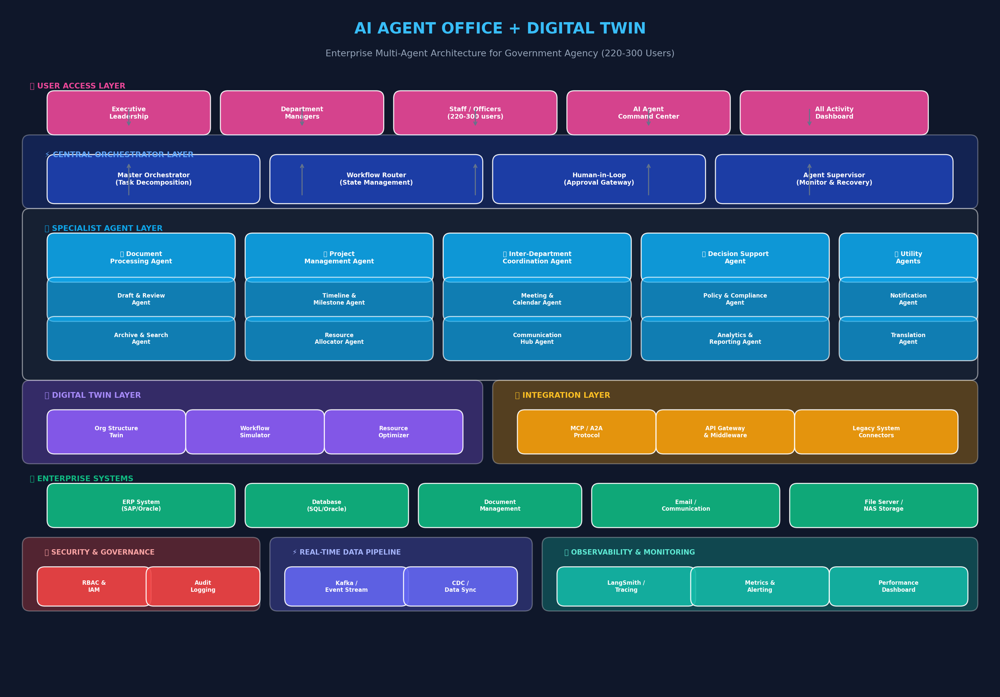
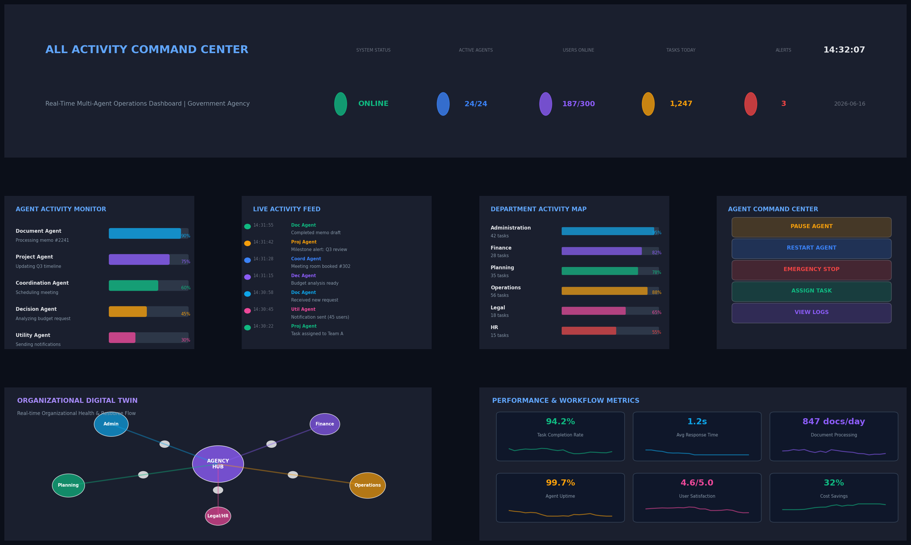

# AI Agent Office + Digital Twin ระดับองค์กร
## แผนการออกแบบและวางระบบสำหรับหน่วยงานราชการ 220-300 ผู้ใช้งาน

---

## TL;DR

ระบบ **AI Agent Office แบบ Multi-Agent Level พร้อม Digital Twin ระดับองค์กร** สำหรับหน่วยงานราชการขนาด 220-300 คน ประกอบด้วย **5 ชั้น Architecture** หลัก: User Access Layer → Central Orchestrator Layer → Specialist Agent Layer (24 Agents) → Digital Twin & Integration Layer → Enterprise Systems Layer พร้อม **All Activity Command Center Dashboard** แบบ Real-Time ที่รองรับการสั่งการ Agents โดยตรง โครงสร้างนี้อ้างอิงแนวทาง **Orchestrator-Worker Pattern** ที่เป็นมาตรฐาน enterprise ปี 2026 [^15^][^20^] และผสมผสานกับ **Agentic Design Patterns** จาก Salesforce [^46^] และ **Digital Twin Framework** สมัยใหม่ [^42^]

---

## 1. บทนำ: ทำไมหน่วยงานราชการต้องการ AI Agent Office + Digital Twin

### 1.1 บริบทและความท้าทายของหน่วยงานราชการ

หน่วยงานราชการในปัจจุบันเผชิญกับความท้าทายหลายประการที่ระบบ AI Agent Office สามารถช่วยแก้ไขได้อย่างมีนัยสำคัญ ประการแรกคือ **ปริมาณงานเอกสารและธุรการที่มหาศาล** ซึ่งกินเวลาของเจ้าหน้าที่ไปกว่า 60% ของเวลาทำงาน [^25^] งานเหล่านี้รวมถึงการร่างเอกสาร การตรวจสอบความถูกต้อง การ routing เอกสารผ่านหลายแผนก และการจัดเก็บข้อมูล ซึ่งล้วนเป็นกระบวนการที่มีรูปแบบซ้ำ ๆ และสามารถถ่ายทอดให้ AI Agent รับผิดชอบได้ ประการที่สองคือ **ความซับซ้อนในการประสานงานระหว่างแผนก** ในหน่วยงานขนาด 220-300 คน มักมี 5-8 แผนกหลักที่ต้องทำงานร่วมกัน การสื่อสารข้ามแผนกมักเกิดความล่าช้า ข้อมูลสูญหาย และไม่มี visibility แบบ real-time ประการที่สามคือ **การขาดเครื่องมือสนับสนุนการตัดสินใจของผู้บริหาร** ซึ่งต้องการภาพรวมขององค์กรแบบ real-time เพื่อตัดสินใจได้อย่างรวดเร็วและแม่นยำ

ตลาด AI ในภาครัฐทั่วโลกมีมูลค่าเติบโตจาก **$22.4 พันล้านดอลลาร์ในปี 2024 เป็น $98 พันล้านดอลลาร์ภายในปี 2033** ซึ่งแสดงถึงอัตราการเติบโต 17.8% ต่อปี [^25^] หน่วยงานรัฐบาลกลางสหรัฐฯ รายงานว่ามีกรณีใช้งาน AI ที่ใช้งานอยู่จริงมากกว่า 1,100 กรณีในปี 2024 เพิ่มขึ้น 9 เท่าจากการใช้งาน Generative AI เพียงปีเดียว [^25^] ในประเทศไทย แนวทางการเปลี่ยนผ่านสู่ **AI-Powered State** ถูกวางเป็น 3 ระดับ: Now Government (Digital Foundation) → AI-Enabled Government (Assisted Intelligence) → AI-Native Government (Agentic Intelligence) [^41^] ซึ่งหน่วยงานที่กำลังวางแผนระบบ AI Agent Office นี้จะอยู่ในระหว่างการเปลี่ยนผ่านจากระดับที่สองสู่ระดับที่สาม

### 1.2 นิยาม AI Agent Office แบบ Multi-Agent Level

AI Agent Office ในระดับ Multi-Agent ไม่ใช่เพียง chatbot หรือ assistant ตัวเดียว แต่เป็น **ระบบนิเวศของ Agent หลายตัวที่ทำงานประสานกัน** เพื่อให้บริการครอบคลุมทุกกระบวนงานของหน่วยงาน แต่ละ Agent มีบทบาท (Role) เฉพาะเจาะจง เครื่องมือ (Tools) ที่แตกต่างกัน และขอบเขตอำนาจ (Permissions) ที่ชัดเจน [^20^][^48^] การทำงานร่วมกันของ Agents เหล่านี้ถูกควบคุมโดย **Orchestrator** ที่ทำหน้าที่แบ่งงาน (Task Decomposition) กำกับดูแล (Supervision) และรวมผลลัพธ์ (Result Aggregation)

ความแตกต่างสำคัญระหว่าง AI Agent Office แบบ Multi-Agent กับระบบ automation แบบเดิมคือ Agents เหล่านี้ไม่ได้รอคำสั่งจากมนุษย์อย่างเดียว แต่สามารถ **ดำเนินการตามเป้าหมาย (Goal-Driven)** ตรวจสอบผลลัพธ์ระหว่างทาง (Self-Correction) และประสานงานกันเองได้แบบอัตโนมัติ [^18^] ตัวอย่างเช่น เมื่อมีเอกสารใหม่เข้ามา Document Processing Agent สามารถวิเคราะห์เนื้อหา ระบุแผนกที่เกี่ยวข้อง ส่งต่อให้ Coordination Agent นัดประชุม และแจ้ง Decision Support Agent เตรียมข้อมูลสำหรับผู้บริหาร โดยไม่ต้องมีมนุษย์คอยสั่งการทุกขั้นตอน

### 1.3 บทบาทของ Digital Twin ในระบบ

Digital Twin ในระบบนี้ทำหน้าที่เป็น **สำเนาดิจิทัลแบบ real-time ของโครงสร้างและกระบวนงานของหน่วยงาน** ไม่ใช่เพียงการแสดงข้อมูลแบบ pass-through แต่เป็นโมเดลที่สามารถจำลองสถานการณ์ (What-If Simulation) วิเคราะห์จุดคอขวด (Bottleneck Detection) และแนะนำการปรับปรุง (Optimization Recommendations) [^42^] Digital Twin นี้จะเชื่อมต่อกับข้อมูลจากทุกระบบในองค์กร รวมถึง ERP Database Document Management และระบบสื่อสาร เพื่อสร้างภาพรวมที่สมบูรณ์

ความสามารถหลัก 3 ประการของ Digital Twin ในระบบนี้คือ: **(1) Org Structure Twin** — สะท้อนโครงสร้างองค์กร ตำแหน่งงาน และความสัมพันธ์ระหว่างแผนกแบบ real-time **(2) Workflow Simulator** — จำลองกระบวนงานเพื่อคาดการณ์ผลกระทบของการเปลี่ยนแปลง เช่น หากย้ายบุคลากร 5 คนจากแผนก A ไปแผนก B จะส่งผลต่อ timeline ของโครงการอย่างไร และ **(3) Resource Optimizer** — วิเคราะห์การใช้ทรัพยากร เช่น เวลาบุคลากร งบประมาณ และอุปกรณ์ เพื่อแนะนำการจัดสรรที่มีประสิทธิภาพที่สุด

---

## 2. Multi-Agent Architecture สำหรับหน่วยงานราชการ

### 2.1 หลักการออกแบบ Architecture

การออกแบบ Multi-Agent Architecture สำหรับหน่วยงานราชการ 220-300 คน ต้องอิงตามหลักการสำคัญหลายประการที่ได้รับการพิสูจน์แล้วใน enterprise deployments ระดับโลก ประการแรกคือ **Orchestrator-Worker Decomposition** ซึ่งเป็นพื้นฐานสำคัญที่แยก Agent ออกเป็นชั้น Orchestrator (ควบคุม) และ Worker (ปฏิบัติการ) [^15^] Orchestrator ไม่ทำงานเองแต่รับผิดชอบการแบ่งเป้าหมายเป็นขั้นตอนย่อย มอบหมายให้ Worker ที่เหมาะสม ติดตามสถานะ และรวมผลลัพธ์ ส่วน Worker Agents แต่ละตัวมีขอบเขตงานแคบ ชุดเครื่องมือเฉพาะ และสิทธิ์จำกัด [^15^][^20^]

หลักการที่สองคือ **Least Privilege at Runtime** ซึ่งหมายความว่าแต่ละ Agent ได้รับสิทธิ์เข้าถึงข้อมูลเฉพาะที่จำเป็นสำหรับงานนั้น ๆ ในเวลานั้นเท่านั้น ไม่ใช่สิทธิ์คงที่ตลอดเวลา [^20^] การควบคุมนี้ต้องดำเนินการที่ Protocol Layer (MCP) ในแต่ละการเรียกใช้เครื่องมือ ไม่ใช่การอนุญาตตามบทบาทตั้งแต่ต้น หลักการที่สามคือ **Full Audit Trails** ซึ่งบังคับให้ทุกการกระทำของ Agent ต้องมีบันทึกที่สมบูรณ์ ระบุว่าเป็น Agent ใด ใน Workflow ใด ตามคำขอของผู้ใช้คนใด เมื่อไหร่ และผลลัพธ์เป็นอย่างไร [^20^] สิ่งนี้จำเป็นสำหรับการตรวจสอบของหน่วยงานราชการ

หลักการที่สี่คือ **Human-in-the-Loop (HITL)** ซึ่งกำหนดจุดที่มนุษย์ต้องเข้ามาตรวจสอบหรืออนุมัติ โดยเฉพาะงานที่มีความสำคัญสูง เช่น การอนุมัติเอกสารที่มีผลผูกพันทางกฎหมาย การจัดสรรงบประมาณ หรือการตัดสินใจที่กระทบต่อประชาชน [^36^] LangGraph Framework ให้การสนับสนุน HITL แบบ first-class ที่สามารถหยุดกระแสงาน (Pause) รอข้อมูลจากมนุษย์ และดำเนินการต่อ (Resume) ได้ [^19^]

### 2.2 Agent Hierarchy และบทบาทของแต่ละ Agent

ระบบ AI Agent Office นี้ประกอบด้วย **24 Agents** แบ่งเป็น 6 กลุ่มหลัก ตามลักษณะงานของหน่วยงานราชการ โดยอิงตาม **Agentic Design Patterns** ของ Salesforce [^46^] และ **Multi-Agent Pattern** ที่ใช้ใน enterprise [^48^]

**กลุ่มที่ 1: Document Processing Agents (3 Agents)** — รับผิดชอบงานเอกสารและธุรการทั้งหมด **Document Processing Agent** ทำหน้าที่หลักในการรับ จำแนกประเภท และกระจายเอกสารเข้าสู่ระบบ **Draft & Review Agent** รับผิดชอบการร่างเอกสารตาม template ที่กำหนด ตรวจสอบความถูกต้องตามมาตรฐานราชการ และแนะนำการแก้ไข **Archive & Search Agent** จัดการการจัดเก็บเอกสารในระบบ Document Management และให้บริการค้นหาอัจฉริยะผ่าน RAG (Retrieval-Augmented Generation)

**กลุ่มที่ 2: Project Management Agents (3 Agents)** — จัดการโครงการและ timeline **Project Management Agent** เป็น Agent หลักที่ติดตามความคืบหน้าโครงการทั้งหมด **Timeline & Milestone Agent** วิเคราะห์ timeline ตรวจจับความล่าช้า และแจ้งเตือนเมื่อ milestone ใกล้ครบกำหนด **Resource Allocator Agent** จัดสรรทรัพยากร บุคลากร และงบประมาณให้กับโครงการตามลำดับความสำคัญ

**กลุ่มที่ 3: Inter-Department Coordination Agents (3 Agents)** — ประสานงานระหว่างแผนก **Coordination Agent** เป็น hub กลางที่รับผิดชอบการสื่อสารข้ามแผนก **Meeting & Calendar Agent** จัดการการนัดหมายประชุม จองห้อง และส่ง agenda อัตโนมัติ **Communication Hub Agent** กระจายข้อความ ประกาศ และข้อมูลสำคัญไปยังบุคลากรที่เกี่ยวข้อง

**กลุ่มที่ 4: Decision Support Agents (3 Agents)** — สนับสนุนการตัดสินใจ **Decision Support Agent** รวบรวมและวิเคราะห์ข้อมูลสำหรับผู้บริหาร **Policy & Compliance Agent** ตรวจสอบความสอดคล้องกับนโยบาย กฎระเบียบ และกฎหมายที่เกี่ยวข้อง **Analytics & Reporting Agent** สร้างรายงาน แดชบอร์ด และการวิเคราะห์เชิงลึก

**กลุ่มที่ 5: Digital Twin Agents (3 Agents)** — ขับเคลื่อน Digital Twin **Org Structure Twin Agent** สร้างและรักษาโมเดลโครงสร้างองค์กร **Workflow Simulator Agent** จำลองกระบวนงานและวิเคราะห์ what-if scenarios **Resource Optimizer Agent** วิเคราะห์และแนะนำการใช้ทรัพยากรอย่างมีประสิทธิภาพ

**กลุ่มที่ 6: Utility Agents (9 Agents)** — บริการสนับสนุนทั่วไป ได้แก่ **Notification Agent** (ส่งการแจ้งเตือน) **Translation Agent** (แปลภาษา) **Security Agent** (ตรวจสอบความปลอดภัย) **Backup Agent** (สำรองข้อมูล) **Notification Agent** (แจ้งเตือน) **Scheduler Agent** (ตั้งเวลาทำงาน) **Logger Agent** (บันทึก log) **Monitor Agent** (ตรวจสอบสุขภาพระบบ) และ **Gateway Agent** (เชื่อมต่อกับระบบภายนอก)

| Agent Group | จำนวน Agents | หน้าที่หลัก | ระดับความสำคัญ |
|---|---|---|---|
| Document Processing | 3 | ร่าง ตรวจสอบ จัดเก็บ ค้นหาเอกสาร | **สูง** |
| Project Management | 3 | ติดตามโครงการ timeline ทรัพยากร | **สูง** |
| Inter-Department Coordination | 3 | ประสานงาน นัดประชุม สื่อสาร | **สูง** |
| Decision Support | 3 | วิเคราะห์ รายงาน ตรวจสอบนโยบาย | **สูงมาก** |
| Digital Twin | 3 | จำลององค์กร วิเคราะห์ what-if จัดสรรทรัพยากร | **สูงมาก** |
| Utility | 9 | แจ้งเตือน แปลภาษา ความปลอดภัย สำรองข้อมูล | **ปานกลาง** |
| **รวม** | **24 Agents** | **ครอบคลุมทุกกระบวนงานหลัก** | — |

### 2.3 Central Orchestrator Layer

Orchestrator Layer เป็นหัวใจสำคัญของระบบ Multi-Agent ทำหน้าที่เหมือน **"ผู้จัดการงานดิจิทัล"** ที่ไม่ได้ปฏิบัติงานเองแต่ควบคุมการทำงานของ Agents ทั้งหมด [^20^] ในปี 2026 มีแนวทางชัดเจนว่า Orchestrator ต้องถูกออกแบบให้ไม่ทำงานเอง (The orchestrator does not do execution) เพราะหาก Orchestrator รับงานปฏิบัติการเข้ามาด้วย จะกลายเป็นจุดคอขวด (Bottleneck) เมื่อระบบขยายตัว [^20^]

ระบบนี้ใช้ **4 Orchestrator Components** หลัก: **Master Orchestrator** รับคำขอจากผู้ใช้ วิเคราะห์ความต้องการ แบ่งงานเป็นชิ้นย่อย (Task Decomposition) และสร้างแผนปฏิบัติการ **Workflow Router** จัดการสถานะของ workflow กำหนดลำดับการทำงาน จัดการการแบ่งกิ่ง (Branching) และวนซ้ำ (Looping) โดยใช้ State Machine Pattern [^19^] **Human-in-Loop Gateway** ควบคุมจุดที่ต้องมีมนุษย์เข้ามาตรวจสอบหรืออนุมัติ รองรับการหยุดรอ (Interrupt) แก้ไขสถานะ (Modify State) และดำเนินต่อ (Resume) และ **Agent Supervisor** ตรวจสอบสุขภาพของ Agents ทั้งหมด จัดการข้อผิดพลาด (Error Recovery) และรีสตาร์ท Agents ที่ล้มเหลว

การเลือกใช้ LangGraph เป็น Framework หลักสำหรับ Orchestrator เนื่องจากให้ **ควบคุมการไหลของงาน (Control Flow) ที่ชัดเจนที่สุด** รองรับการ checkpoint ระหว่างขั้นตอน และมี LangSmith สำหรับตรวจสอบและแก้ไขปัญหา [^17^][^19^] สำหรับการพัฒนาprototype หรือส่วนที่ต้องการความคิดสร้างสรรค์สูง อาจใช้ CrewAI ร่วมกันได้ตามแนวทางที่แนะนำใน enterprise [^23^]

### 2.4 Protocol Layer: MCP และ A2A

การสื่อสารระหว่าง Agents และระบบต่าง ๆ ในองค์กรต้องใช้มาตรฐาน Protocol ที่ชัดเจน เพื่อให้สามารถตรวจสอบ ควบคุม และขยายระบบได้ในอนาคต ในปี 2026 มี Protocol สำคัญ 2 ตัวที่เป็นมาตรฐานของ enterprise [^22^]

**Model Context Protocol (MCP)** สร้างโดย Anthropic ใช้สำหรับการเชื่อมต่อ Agents กับเครื่องมือและแหล่งข้อมูลภายนอก มีลักษณะเป็น Client-Server Architecture โดย Model เป็น Client และ Tools เป็น Server ใช้ JSON-RPC เป็นพื้นฐานการสื่อสาร และมีการตรวจสอบ Schema ที่เข้มงวด [^22^] MCP มี SDK ที่ได้รับความนิยมสูงถึง **97 ล้านดาวน์โหลดต่อเดือน** ในเดือนมีนาคม 2026 [^22^] ใช้สำหรับ: Agents เรียกใช้เครื่องมือ ดึงข้อมูลจาก Database หรือเข้าถึงระบบภายใน

**Agent-to-Agent Protocol (A2A)** สร้างโดย Google ใช้สำหรับการสื่อสารโดยตรงระหว่าง Agents ด้วยกัน มีลักษณะ Peer-to-Peer Agents สามารถค้นพบความสามารถของกันและกัน (Capability Discovery) ผ่าน "Agent Cards" ที่ประกาศในรูปแบบ JSON ที่ `/.well-known/agent.json` [^22^] A2A ถึงเวอร์ชัน 1.0 ในต้นปี 2026 พร้อมรองรับ gRPC และ OAuth 2.1 และได้รับการสนับสนุนจากองค์กร enterprise กว่า 100 แห่ง รวมถึง Microsoft, AWS, Salesforce, SAP และ Cisco [^20^][^22^]

ทั้งสอง Protocol นี้เติมเต็มกัน: **MCP ควบคุมการติดต่อระหว่าง Agents กับ Tools/Data ส่วน A2A ควบคุมการติดต่อระหว่าง Agents ด้วยกัน** [^20^] สำหรับหน่วยงานราชการที่เน้นความปลอดภัยและการตรวจสอบได้ A2A มีข้อได้เปรียบเนื่องจากมีคุณสมบัติด้านความปลอดภัยและการตรวจสอบ (Audit Logging)  built-in ใน Protocol เลย [^22^]

---

## 3. Digital Twin ระดับองค์กร (Enterprise Digital Twin)

### 3.1 แนวคิด Digital Twin สำหรับหน่วยงานราชการ

Digital Twin ในการบริบทของหน่วยงานราชการไม่ใช่แค่การแสดงข้อมูลแบบ 3D หรือ Visualization ธรรมดา แต่เป็น **โมเดลคณิตศาสตร์ที่สะท้อนพฤติกรรมขององค์กรแบบ real-time** โดยอิงตามแนวทาง Digital Twin Consortium และมาตรฐาน ISO ที่กำลังพัฒนาในปี 2026 [^42^] Digital Twin นี้จะรวมข้อมูลจากหลายแหล่ง: โครงสร้างองค์กร (Organization Chart) ข้อมูลบุคลากร (HR Database) กระบวนงาน (Workflow Logs) ทรัพยากร (Resource Allocation) และระบบภายนอก (ERP, Document Management)

แนวโน้มสำคัญในปี 2026 คือการผสมผสาน **AI/ML เข้ากับ Digital Twin** ทำให้สามารถทำ Predictive Analytics (คาดการณ์ปัญหาก่อนเกิด) Anomaly Detection (ตรวจจับความผิดปกติ) และ Generative Simulations (จำลอง what-if scenarios) ได้โดยอัตโนมัติ [^42^] ตัวอย่างเช่น Digital Twin สามารถเรียนรู้จากข้อมูลในอดีตว่าเมื่อมีโครงการประมาณ 10 โครงการที่ทำพร้อมกัน ความล่าช้าจะเกิดขึ้นในแผนกใดบ่อยที่สุด และแนะนำการจัดสรรทรัพยากรล่วงหน้า

### 3.2 สถาปัตยกรรม Digital Twin Layer

Digital Twin Layer ประกอบด้วย 3 ส่วนหลักที่ทำงานร่วมกัน:

**Org Structure Twin** สร้างโมเดลโครงสร้างองค์กรแบบกราฟ (Graph Model) โดย Nodes แทนบุคลากร ตำแหน่ง และแผนก ส่วน Edges แทนความสัมพันธ์ เช่น รายงานต่อ (Reports To) ร่วมงานกับ (Collaborates With) และสังกัด (Belongs To) โมเดลนี้อัปเดตแบบ real-time จากข้อมูล HR และระบบลงเวลางาน รองรับการวิเคราะห์ Organizational Network Analysis (ONA) เพื่อระบุ "Key Connectors" บุคลากรที่มีบทบาทสำคัญในการประสานงาน และจุดที่เกิด "Silos" การทำงานแยกจากกัน [^29^]

**Workflow Simulator** ใช้ข้อมูลกระบวนงานในอดีต (Historical Workflow Data) สร้างโมเดลการทำงานของแต่ละแผนก สามารถจำลองสถานการณ์ต่าง ๆ เช่น "หากโครงการ A ล่าช้า 2 สัปดาห์ จะส่งผลกระทบต่อโครงการ B C D อย่างไร" หรือ "หากย้ายบุคลากร 3 คนจากแผนก X ไปช่วยแผนก Y จะทำให้ภาระงานของแผนก X เพิ่มขึ้นเท่าใดและแผนก Y จะเสร็จเร็วขึ้นเท่าใด" ความสามารถนี้เป็นประโยชน์อย่างยิ่งสำหรับผู้บริหารในการตัดสินใจ reallocating ทรัพยากร [^42^]

**Resource Optimizer** วิเคราะห์การใช้ทรัพยากรทั้งหมดของหน่วยงาน รวมถึงเวลาบุคลากร งบประมาณ อุปกรณ์ และพื้นที่ ใช้อัลกอริทึม Optimization เช่น Linear Programming หรือ Reinforcement Learning เพื่อหาการจัดสรรที่มีประสิทธิภาพสูงสุด ตัวอย่างเช่น การกระจายงานเอกสารให้กับเจ้าหน้าที่ที่มีเวลาว่างมากที่สุด หรือการจัดลำดับโครงการตามผลตอบแทนต่อทรัพยากรที่ใช้

### 3.3 การเชื่อมต่อ Digital Twin กับระบบ Existing

การเชื่อมต่อ Digital Twin กับระบบที่มีอยู่ในหน่วยงาน (ERP Database Document Management Email System) ต้องใช้แนวทางที่รอบคอบเพื่อไม่ให้กระทบต่อระบบเดิม มี **5 Integration Patterns** หลักที่ใช้ได้ [^38^]

**Pattern 1: API Wrapper Layer** — สร้าง Microservice บาง ๆ ที่แปลง Interface ของระบบเก่าเป็น REST API สมัยใหม่ ตัวอย่างเช่น หาก ERP รองรับ RFC (Remote Function Call) ให้สร้าง Wrapper ด้วย Python (pyrfc) หรือ Node.js (node-rfc) เพื่อแปลงเป็น REST endpoints ที่ AI Agents สามารถเรียกใช้ได้ [^38^]

**Pattern 2: Database Direct Access (Read-Only)** — หากต้องการอ่านข้อมูลอย่างเดียว สามารถเชื่อมต่อกับ Database โดยตรงผ่าน ODBC/JDBC แต่ต้องใช้ Read Replica เพื่อไม่ให้กระทบประสิทธิภาพระบบหลัก [^38^]

**Pattern 3: Event-Driven Integration** — ใช้ Message Broker เช่น Apache Kafka หรือ RabbitMQ รับ Events จากระบบเดิมแล้วส่งต่อให้ Digital Twin และ Agents วิธีนี้มีความเสี่ยงต่ำที่สุดเพราะไม่ต้องแก้ไขระบบเดิม [^38^]

**Pattern 4: RPA Bridge** — ใช้ RPA Tools (UiPath, Automation Anywhere) ควบคุม UI ของระบบเก่าแล้วส่งผลลัพธ์ให้ Agents ใช้ในกรณีที่ไม่มีวิธีเชื่อมต่อทางเทคนิคอื่น [^38^]

**Pattern 5: ETL to Modern Store** — ดึงข้อมูลจากระบบเก่าผ่าน ETL Pipeline ไปเก็บใน Data Warehouse หรือ Vector Database ที่ Agents สามารถ query ได้อย่างมีประสิทธิภาพ [^38^]

| Integration Pattern | ความซับซ้อน | ความเสี่ยง | เหมาะกับ | เวลาติดตั้ง |
|---|---|---|---|---|
| API Wrapper Layer | ปานกลาง | ต่ำ | ระบบที่มี Interface อยู่แล้ว | 4-8 สัปดาห์ |
| Database Read-Only | ต่ำ | ต่ำมาก | การอ่านข้อมูลอย่างเดียว | 2-4 สัปดาห์ |
| Event-Driven | ปานกลาง-สูง | ต่ำ | การอัปเดตแบบ real-time | 6-10 สัปดาห์ |
| RPA Bridge | ต่ำ | ปานกลาง | ระบบที่ไม่มี API | 2-6 สัปดาห์ |
| ETL to Modern Store | ปานกลาง | ต่ำ | การวิเคราะห์ข้อมูลย้อนหลัง | 4-8 สัปดาห์ |

---

## 4. Workspace ออกแบบสำหรับ 220-300 ผู้ใช้งาน

### 4.1 หลักการออกแบบ Workspace

การออกแบบ Workspace สำหรับระบบ AI Agent Office ต้องคำนึงถึง **3 Design Patterns หลักที่ได้รับการพิสูจน์แล้วใน production** [^45^]: **Plan-and-Execute** (แสดงแผนการก่อนปฏิบัติ) **Confidence Signaling** (แสดงระดับความมั่นใจของ Agent) และ **Progressive Delegation** (มอบอำนาจค่อยเป็นค่อยไป)

Workspace ต้องตอบสนองต่อ **4 กลุ่มผู้ใช้งานหลัก** ที่มีความต้องการแตกต่างกัน: **Executive Leadership** ต้องการภาพรวมระดับสูงและการสนับสนุนการตัดสินใจ **Department Managers** ต้องการติดตามงานในแผนกและประสานงานกับแผนกอื่น **Staff/Officers (220-300 คน)** ต้องการเครื่องมือที่ช่วยให้ทำงานประจำวันได้ง่ายขึ้น และ **AI Agent Operators** ต้องการควบคุมและตรวจสอบการทำงานของ Agents

### 4.2 โครงสร้าง Workspace แบบ Role-Based

Workspace ถูกออกแบบเป็น **Single-Page Application (SPA)** ที่ปรับเปลี่ยนตาม Role ของผู้ใช้งาน โดยมีส่วนประกอบหลัก 4 ส่วน:

**Left Navigation Panel** — แสดงเมนูหลักที่ปรับตาม Role ผู้ใช้ รวมถึง Dashboard My Tasks Agents (สำหรับควบคุม Agents) Digital Twin (สำหรับดูภาพรวมองค์กร) Reports และ Settings การออกแบบนี้อิงตามหลักการ **Strategic Creative Partner on Left Panel** ที่ให้ AI อยู่ในตำแหน่งที่มองเห็นและเข้าถึงได้ตลอดเวลา [^49^]

**Main Content Area** — พื้นที่หลักที่แสดงเนื้อหาตามหน้าที่เลือก ออกแบบให้รองรับ **Multi-Panel Layout** ที่ผู้ใช้สามารถปรับแต่งได้ ตามแนวทาง **Workspace (Radar O'Reilly) Pattern** ของ Salesforce [^46^]

**Right Context Panel** — แสดงข้อมูลเชิงลึกและ AI Assistance ตามบริบทของงานที่กำลังทำ อิงตามหลักการ **Deep Context Expert on Right Panel** [^49^] ผู้ใช้สามารถเรียก AI มาช่วยได้ทุกเมื่อโดยไม่รบกวนงานหลัก

**Bottom Status Bar** — แสดงสถานะของระบบ จำนวน Agents ที่ทำงานอยู่ การแจ้งเตือน และ shortcuts สำคัญ

### 4.3 User Flow สำหรับแต่ละกลุ่มผู้ใช้

**Staff/Officers (ผู้ใช้งานหลัก 220-300 คน):**
เมื่อเข้าสู่ระบบ Staff เห็น **Personal Dashboard** ที่แสดงงานของตนเอง งานที่ Agents ช่วยทำอยู่ และการแจ้งเตือน สามารถสั่งงาน Agents ได้ผ่าน Natural Language เช่น "ช่วยร่างหนังสือตอบกลับเรื่องขออนุมัติงบประมาณ" หรือ "สรุปรายงานการประชุมครั้งล่าสุด" Agents จะแสดง **Plan-and-Execute** ก่อนเริ่มทำงาน ให้ Staff ตรวจสอบและแก้ไขแผนได้ก่อน execution [^45^]

**Department Managers:**
เห็น **Department Dashboard** ที่แสดงงานทั้งหมดในแผนก ภาระงานของบุคลากรแต่ละคน และงานที่ต้องประสานงานกับแผนกอื่น สามารถใช้ Coordination Agent เพื่อนัดประชุมอัตโนมัติ หรือใช้ Resource Allocator Agent เพื่อกระจายงานให้สมดุล มีสิทธิ์อนุมัติงานที่ Agents ทำเสร็จแล้ว (Human-in-the-Loop)

**Executive Leadership:**
เห็น **Strategic Dashboard** ที่แสดงภาพรวมของทั้งหน่วยงานผ่าน **Digital Twin Visualization** สามารถดู KPI หลัก ตรวจสอบความคืบหน้าโครงการสำคัญ และใช้ Decision Support Agent เพื่อวิเคราะห์สถานการณ์ต่าง ๆ มีสิทธิ์สูงสุดในการสั่งการ Agents และกำหนดนโยบายการทำงาน

---

## 5. All Activity Dashboard แบบ Real-Time

### 5.1 สถาปัตยกรรม Dashboard

All Activity Dashboard เป็น **Command Center** ที่รวมข้อมูลจากทุก Agents ทุกแผนก และทุกระบบในองค์กร แสดงผลแบบ real-time โดยใช้ **Event-Driven Architecture** ผ่าน Kafka หรือ WebSocket ข้อมูลที่แสดงบน Dashboard มาจาก 3 แหล่งหลัก: **Agent State Store** (สถานะการทำงานของ Agents) **Digital Twin Model** (ภาพรวมองค์กร) และ **Enterprise Systems** (ข้อมูลจาก ERP Database ฯลฯ)

Dashboard ถูกออกแบบตามหลักการ **Goal-Centric Command Center** [^28^] ซึ่งหมายความว่าผู้ใช้มองเห็น **เป้าหมาย (Goals)** และสถานะของเป้าหมาย ไม่ใช่กระบวนการหรือเทอร์มินัลที่ทำงานอยู่เบื้องหลัง รูปแบบการแสดงผลหลักเป็น **Kanban-Style** โดยเป้าหมายแต่ละอันแสดงเป็นบัตร (Card) ที่เคลื่อนย้ายระหว่างคอลัมน์: Queued → In Progress → Needs Review → Blocked → Done [^28^]

### 5.2 องค์ประกอบของ Dashboard (6 Panels)

**Panel 1: Agent Activity Monitor** — แสดงสถานะการทำงานของ Agents ทั้งหมดแบบ real-time แต่ละ Agent แสดงเป็น Progress Bar พร้อมข้อความสถานะ เช่น "Processing memo #2241" หรือ "Updating Q3 timeline" ผู้ใช้สามารถคลิกที่ Agent ใดก็ได้เพื่อดูรายละเอียดเพิ่มเติมหรือสั่งการ เช่น Pause Restart หรือ Reassign Task

**Panel 2: Live Activity Feed** — บันทึกกิจกรรมล่าสุดของระบบเรียงตามเวลา แสดงเวลา Agent ที่กระทำ และคำอธิบายของกิจกรรม รองรับการกรองตาม Agent Type แผนก หรือระดับความสำคัญ Feed นี้ช่วยให้ผู้ใช้เห็นว่าเกิดอะไรขึ้นในระบบในแต่ละวินาที

**Panel 3: Department Activity Map** — แสดงภาพรวมของแต่ละแผนก รวมถึงจำนวนงานที่กำลังทำ ภาระงาน (Load) เป็นเปอร์เซ็นต์ และสถานะโดยรวม ใช้สีและความยาวของแถบเพื่อแสดงระดับความยุ่ง ช่วยให้ผู้บริหารเห็นว่าแผนกใดกำลังมีปัญหาหรือต้องการทรัพยากรเพิ่ม

**Panel 4: Agent Command Center** — พื้นที่สำหรับสั่งการ Agents โดยตรง มีปุ่มควบคุมหลัก: **Pause Agent** (หยุดชั่วคราว) **Restart Agent** (เริ่มใหม่) **Emergency Stop** (หยุดฉุกเฉิน) **Assign Task** (มอบหมายงานใหม่) และ **View Logs** (ดูบันทึกการทำงาน) การออกแบบนี้ให้ผู้ใช้มีความสามารถในการ **interact/command agents** ตามที่ต้องการ [^28^][^33^]

**Panel 5: Organizational Digital Twin** — แสดง visualization ของโครงสร้างองค์กรแบบกราฟ โดยมี Agency Hub อยู่ตรงกลางและแผนกต่าง ๆ อยู่รอบ ๆ แสดงการไหลของข้อมูลและงานระหว่างแผนกด้วยเส้นเชื่อมที่มี animation แสดงจุดที่เกิดความล่าชาหรือคอขวดด้วยสีแดง

**Panel 6: Performance & Workflow Metrics** — แสดงตัวชี้วัดสำคัญ 6 ประการ: Task Completion Rate (อัตราการเสร็จงาน) Avg Response Time (เวลาตอบสนองเฉลี่ย) Document Processing (จำนวนเอกสารที่ประมวลผลต่อวัน) Agent Uptime (เวลาทำงานของ Agents) User Satisfaction (ความพึงพอใจของผู้ใช้) และ Cost Savings (การประหยัดต้นทุน) แต่ละ metric แสดงค่าปัจจุบันและ Sparkline แสดงแนวโน้ม

### 5.3 ความสามารถในการ Interact/Command Agents

Dashboard รองรับการสั่งการ Agents ใน 3 ระดับ:

**ระดับ 1: Monitoring (ดูอย่างเดียว)** — ผู้ใช้ทั่วไปสามารถดูสถานะ Agents และกิจกรรมได้ แต่ไม่สามารถสั่งการได้ เหมาะสำหรับ Staff ที่ต้องการรู้ว่า Agent กำลังทำอะไรให้ตนเอง

**ระดับ 2: Basic Control (ควบคุมพื้นฐาน)** — Department Managers สามารถ Pause/Restart Agents ในแผนกตนเอง Assign Task ใหม่ และ View Logs ได้ สามารถอนุมัติงานที่ Agents เสนอ (Human-in-the-Loop)

**ระดับ 3: Full Control (ควบคุมเต็มรูปแบบ)** — Executive Leadership และ AI Operators สามารถสั่งการทุก Agents รวมถึง Emergency Stop ทั้งระบบ กำหนดนโยบายการทำงาน และปรับแต่งพฤติกรรม Agents

การสั่งการทำได้หลายช่องทาง: **ผ่าน Dashboard UI** (คลิกปุ่ม) **ผ่าน Natural Language** (พิมพ์คำสั่งในช่อง chat) และ **ผ่าน Pre-defined Commands** (เลือกจากรายการคำสั่งที่กำหนดไว้ล่วงหน้า) ทุกคำสั่งถูกบันทึกไว้ใน Audit Log พร้อมระบุผู้สั่งการ เวลา และผลลัพธ์ [^20^]

---

## 6. แผนการ Implement แบบ Phase-by-Phase

### 6.1 Phase 1: Foundation & Pilot (เดือน 1-4)

Phase แรกเน้นการสร้างพื้นฐานและทดสอบระบบกับกลุ่มผู้ใช้จำกัด ตามแนวทาง **Non-invasive augmentation** ที่แนะนำสำหรับการ integrate กับ legacy systems [^43^]

**เดือน 1-2: Infrastructure & Design**
- ตั้งค่า Infrastructure: Kubernetes Cluster, Database, Message Queue (Kafka)
- ออกแบบ Data Pipeline สำหรับเชื่อมต่อกับระบบ Existing (ERP, Database)
- สร้าง AI Adapter Layer สำหรับแปลง Interface ระบบเก่า [^39^]
- กำหนด Security Policy: RBAC, Encryption, Audit Logging
- เลือกและติดตั้ง Framework: LangGraph (หลัก) + CrewAI (สำรอง)

**เดือน 3-4: Pilot Deployment**
- Deploy Document Processing Agents (3 Agents) ในแผนกทดลอง 1 แผนก
- สร้าง Basic Dashboard สำหรับดูสถานะ Agents
- ทดสอบ Human-in-the-Loop Workflow
- เก็บ Feedback จากผู้ใช้ 10-15 คน
- ปรับปรุงตามผลการทดสอบ

**ผลลัพธ์ที่คาดหวัง:** ลดเวลาการประมวลผลเอกสารลง 30-40% ในหน่วยงานนำร่อง

### 6.2 Phase 2: Multi-Agent Expansion (เดือน 5-8)

ขยายระบบให้ครอบคลุม Agents กลุ่มอื่นและเพิ่มจำนวนผู้ใช้

**เดือน 5-6: Project & Coordination Agents**
- Deploy Project Management Agents (3 Agents)
- Deploy Inter-Department Coordination Agents (3 Agents)
- สร้าง Workflow Orchestration ที่ซับซ้อนขึ้น
- เชื่อมต่อกับระบบ Calendar และ Email

**เดือน 7-8: Digital Twin & Dashboard**
- สร้าง Digital Twin Layer พื้นฐาน (Org Structure Twin)
- พัฒนา All Activity Dashboard เวอร์ชันเต็ม
- เพิ่มความสามารถในการ Command Agents ผ่าน Dashboard
- ขยายผู้ใช้เป็น 100-150 คน (50% ของเป้าหมาย)

**ผลลัพธ์ที่คาดหวัง:** ครอบคลุมงานเอกสาร โครงการ และการประสานงาน ลดเวลาธุรการรวม 40-50%

### 6.3 Phase 3: Full Deployment & Digital Twin (เดือน 9-12)

ขยายระบบให้ครอบคลุมทุกฟังก์ชันและผู้ใช้ทั้งหมด

**เดือน 9-10: Decision Support & Full Integration**
- Deploy Decision Support Agents (3 Agents)
- สร้าง Workflow Simulator และ Resource Optimizer
- เชื่อมต่อกับระบบทั้งหมด (ERP, Document Management, Email, File Server)
- ขยายผู้ใช้เป็น 220-300 คน (100%)

**เดือน 11-12: Optimization & Governance**
- ปรับแต่งประสิทธิภาพ Agents ตามข้อมูลการใช้งานจริง
- สร้าง Governance Framework เต็มรูปแบบ
- ฝึกอบรมผู้ใช้ทั้งหมด
- จัดทำ Documentation และ Playbook

**ผลลัพธ์ที่คาดหวัง:** ระบบทำงานเต็มรูปแบบ ลดเวลาธุรการรวม 50-60% เพิ่มความเร็วในการตัดสินใจของผู้บริหาร

### 6.4 Phase 4: Continuous Improvement (เดือน 13+)

หลังจาก Deploy ครบแล้ว ต้องมีการปรับปรุงอย่างต่อเนื่อง

- **Agent Learning:** ใช้ข้อมูลการใช้งานเพื่อปรับปรุงพฤติกรรม Agents ผ่าน Reinforcement Learning from Human Feedback (RLHF)
- **Digital Twin Enhancement:** เพิ่มความละเอียดของ Simulation และ Optimization
- **New Agent Development:** พัฒนา Agents ใหม่ตามความต้องการที่เกิดขึ้น
- **Performance Tuning:** ปรับแต่ง latency throughput และ resource usage
- **Security Updates:** อัปเดตมาตรการความปลอดภัยอย่างสม่ำเสมอ

| Phase | ระยะเวลา | เป้าหมายหลัก | Agents ที่ Deploy | จำนวนผู้ใช้ |
|---|---|---|---|---|
| 1: Foundation | เดือน 1-4 | Infrastructure + Pilot | 3 (Document) | 10-15 |
| 2: Expansion | เดือน 5-8 | Multi-Agent + Dashboard | 12 (+Project +Coordination) | 100-150 |
| 3: Full Deploy | เดือน 9-12 | Decision Support + Digital Twin | 24 (ทั้งหมด) | 220-300 |
| 4: Improvement | เดือน 13+ | Optimize + Learn + Expand | 24+ (ใหม่ตามต้องการ) | 220-300+ |

---

## 7. การออกแบบ Agent Workspace และ User Interface

### 7.1 หลักการออกแบบ UI สำหรับ AI Agent

การออกแบบ UI สำหรับระบบ AI Agent ต้องคำนึงถึงความต่างจากการออกแบบ UI ทั่วไป เนื่องจากผู้ใช้ต้องมี **ความไว้วางใจ (Trust)** และ **ความเข้าใจ (Understanding)** ในการกระทำของ Agents [^45^] มี **5 UX Patterns หลัก** ที่ต้อง implement:

**Planning Visibility** — ผู้ใช้ต้องเห็นแผนการกระทำของ Agent ก่อน execution เริ่ม โดยแสดงเป็นรายการขั้นตอน (Step List) ที่ผู้ใช้สามารถแก้ไขหรือลบได้ก่อนอนุมัติ ระหว่าง execution ขั้นตอนที่เสร็จแล้วแสดงเครื่องหมายถูก ขั้นตอนที่กำลังทำแสดงอนิเมชัน progress [^45^]

**Tool-Use Disclosure** — แสดงว่า Agent เรียกใช้ระบบใด ได้รับข้อมูลอะไรกลับมา และผู้ใช้สามารถตรวจสอบผลลัพธ์จากระบบนั้นได้หรือไม่ การซ่อน Tool Calls ทำให้ผลลัพธ์ดูมีอำนาจแต่ไม่สามารถตรวจสอบได้ ซึ่งเป็นสาเหตุหลักที่ผู้ใช้ปฏิเสธการใช้งาน [^45^]

**Memory Surfacing** — แสดงว่า Agent จดจำอะไรเกี่ยวกับผู้ใช้ และผู้ใช้สามารถแก้ไขข้อมูลที่จดจำผิดได้อย่างไร การซ่อน Memory ทำให้ผู้ใช้รู้สึกว่าระบบ "ล้ำลึกเกินไป" โดยไม่เข้าใจว่าทำไมถึงรู้เรื่องส่วนตัวของตน [^45^]

**Multi-Step Workflow Tracking** — แยกการติดตาม workflow ออกจากการสนทนา (Chat) เพราะจังหวะการสนทนาและจังหวะ workflow เป็น 2 สิ่งที่แตกต่างกัน ใช้ Timeline View หรือ Activity Panel ที่แสดงว่าอะไรเสร็จแล้ว อะไรกำลังทำ อะไรติดขัด และอะไรเป็นขั้นตอนถัดไป [^45^]

**Recovery Routing** — เมื่อเกิดข้อผิดพลาด ระบบต้องส่งผู้ใช้ไปยังเส้นทางแก้ไขที่เหมาะสมกับปัญหานั้น ๆ ไม่ใช่แค่แสดงปุ่ม Retry ทั่วไป ตัวอย่างเช่น หากคำขอไม่ชัดเจน ต้องส่งกลับไปที่ช่องใส่คำขอเดิม หาก Tool Call ล้มเหลว ต้องส่งไปที่การตรวจสอบขอบเขตของเครื่องมือ [^45^]

### 7.2 องค์ประกอบหน้าจอหลัก

**หน้าแรก (Home Dashboard)** — แสดงภาพรวมส่วนตัวของผู้ใช้ รวมถึง:
- **My Active Tasks** — งานที่กำลังทำและงานที่ Agents ช่วยทำอยู่
- **Recent Agent Activities** — กิจกรรมล่าสุดของ Agents ที่เกี่ยวข้องกับผู้ใช้
- **Quick Actions** — ปุ่มลัดสำหรับสั่งงาน Agents ที่ใช้บ่อย
- **Notifications** — การแจ้งเตือนที่ต้องดำเนินการ
- **Department Overview** — สถานะของแผนก (สำหรับ Managers)

**หน้า Agents (Agent Control Panel)** — ศูนย์ควบคุม Agents:
- รายการ Agents ทั้งหมดพร้อมสถานะ (Online, Busy, Paused, Error)
- ความสามารถในการ Start/Stop/Pause/Restart แต่ละ Agent
- ช่องสั่งงาน Agents ผ่าน Natural Language
- ประวัติการทำงาน (Logs) ของแต่ละ Agent
- การตั้งค่าและกำหนดนโยบายของ Agents

**หน้า Digital Twin (Organization View)** — แสดงภาพรวมองค์กร:
- Org Chart แบบ Interactive ที่อัปเดต real-time
- Heat Map แสดงภาระงานของแต่ละแผนก
- Flow Visualization แสดงการไหลของงานระหว่างแผนก
- What-If Simulator สำหรับทดสอบสถานการณ์ต่าง ๆ
- Resource Allocation View แสดงการใช้ทรัพยากร

**หน้า All Activity (Command Center)** — Dashboard แบบเต็มจอ:
- 6 Panels ตามที่อธิบายในหัวข้อ 5.2
- Real-time updates ผ่าน WebSocket
- ความสามารถในการ Filter และ Drill-down
- การสั่งการ Agents โดยตรงจาก Dashboard

### 7.3 การออกแบบสำหรับ 220-300 ผู้ใช้งานพร้อมกัน

การออกแบบ UI สำหรับผู้ใช้ 220-300 คนพร้อมกันต้องคำนึงถึง **Scalability ของ Frontend** และ **Performance ของ Real-time Updates** แนวทางหลักคือ:

**Progressive Loading** — โหลดข้อมูลที่จำเป็นทันที (Critical Data) ก่อน ส่วนข้อมูลรอง (Secondary Data) โหลดแบบ Lazy Load ตัวอย่างเช่น Dashboard โหลดสถานะระบบและกิจกรรมล่าสุดทันที แต่ข้อมูลย้อนหลัง 24 ชั่วโมงโหลดเพิ่มเมื่อผู้ใช้ scroll

**Connection Pooling** — ใช้ WebSocket Connection ที่รวมศูนย์ (Central Hub) แทนที่แต่ละผู้ใช้จะเปิด Connection แยก ลดภาระของ Server และเพิ่มจำนวนผู้ใช้ที่รองรับได้

**Data Aggregation** — แทนที่จะส่ง updates แยกสำหรับแต่ละ event ให้รวม updates ที่เกิดขึ้นใน window เวลาสั้น ๆ (เช่น 100ms) แล้วส่งครั้งเดียว ลดจำนวน messages ที่ส่งผ่าน network

**Client-Side Caching** — ใช้ Redis หรือ Similar บน Client Side เพื่อ cache ข้อมูลที่ไม่เปลี่ยนแบบบ่อย ๆ (เช่น Org Structure User Profiles) ลดการ query ไปยัง Server

---

## 8. Security, Governance และ Compliance

### 8.1 ความท้าทายด้านความปลอดภัยของ Multi-Agent System

ระบบ Multi-Agent ที่มี Agents หลายสิบตัวทำงานอัตโนมัติภายในระบบราชการย่อมมีความเสี่ยงด้านความปลอดภัยที่ต้องจัดการอย่างจริงจัง ประการแรกคือ **Privilege Escalation** — หาก Orchestrator ถูก manipulate ให้ส่งงานผิดพลาด อาจทำให้ Agent ที่มีสิทธิ์สูงถูกใช้งานในทางที่ไม่เหมาะสม [^20^] วิธีป้องกันคือต้อง constrain สิทธิ์ของแต่ละ Agent ที่ Runtime ผ่าน MCP Layer ในแต่ละ Tool Call ไม่ใช่การอนุญาตตาม Role ตั้งแต่ต้น

ประการที่สองคือ **Shadow AI Deployments** — หากไม่มีการควบคุมที่ดี อาจเกิด Agents ที่ไม่ได้รับอนุญาต (Shadow Agents) ทำงานในระบบ ซึ่งเป็น vector การโจมตีที่เติบโตเร็วที่สุดใน enterprise ปี 2026 [^20^] วิธีป้องกันคือต้องมี **AI Inventory** ที่บันทึก Agent ทุกตัวในระบบ พร้อมข้อมูลเจ้าของ วัตถุประสงค์ ระดับการเข้าถึงข้อมูล และกำหนดการตรวจสอบ

ประการที่สามคือ **Data Residency และ Sovereignty** — ข้อมูลของหน่วยงานราชการอาจมีข้อจำกัดเรื่องการเก็บและประมวลผลนอกประเทศ ระบบต้องรองรับการ deploy แบบ On-Premise หรือ Private Cloud และมีการเข้ารหัส (Encryption) ทั้งในระหว่างส่ง (In Transit) และการจัดเก็บ (At Rest)

### 8.2 Framework การกำกับดูแล (Governance Framework)

ระบบต้องมี Governance Framework ที่ครอบคลุม 5 ด้านหลัก:

**Identity and Access Management (IAM)** — ใช้ RBAC (Role-Based Access Control) ที่ละเอียดระดับ Agent ไม่ใช่แค่ระดับผู้ใช้ แต่ละ Agent ต้องมี Identity เป็นของตนเองและสิทธิ์ที่ชัดเจน รองรับ SSO (Single Sign-On) ผ่าน SAML หรือ OAuth 2.1 [^36^]

**Audit Logging** — บันทึกทุกการกระทำของ Agents ด้วยข้อมูลครบถ้วน: Agent ID, Workflow ID, User Request ID, Timestamp, Input, Output, Tools Used, และ Decisions Made บันทึกนี้ต้องเป็น **Immutable** (แก้ไขไม่ได้) และเก็บอย่างน้อย 7 ปีตามมาตรฐานราชการ [^20^]

**Policy as Infrastructure** — กฎเกณฑ์ด้านการใช้ข้อมูล ข้อจำกัดด้านกฎระเบียบ และข้อกำหนดด้าน Data Residency ต้องถูกบังคับใช้โดยอัตโนมัติที่ Protocol Layer ไม่ใช่การตรวจสอบย้อนหลัง หาก Agent พยายามเข้าถึง Database ที่จำกัด การเรียกนั้นจะถูกบล็อกทันทีที่ Protocol Layer [^20^]

**Just-in-Time Permissions** — สิทธิ์เข้าถึงข้อมูลให้เฉพาะช่วงเวลาที่ทำงานนั้น ๆ และเพิกถอนทันทีเมื่องานเสร็จสิ้น ไม่อนุญาตให้ Agents สะสมสิทธิ์สูงแบบถาวรข้าม Session [^20^]

**Human-in-the-Loop Requirements** — กำหนดชัดเจนว่างานใดต้องมีมนุษย์อนุมัติก่อนดำเนินการ เช่น การอนุมัติเอกสารที่มีผลผูกพันทางกฎหมาย การจัดสรรงบประมาณ การเปลี่ยนแปลงนโยบาย และการตัดสินใจที่กระทบต่อประชาชน

### 8.3 การปฏิบัติตามกฎระเบียบภาครัฐ

ระบบ AI Agent ในหน่วยงานราชการต้องปฏิบัติตามกฎระเบียบหลายระดับ:

**ระดับกฎหมาย:** พระราชบัญญัติคุ้มครองข้อมูลส่วนบุคคล (PDPA) พระราชบัญญัติว่าด้วยธุรกรรมทางอิเล็กทรอนิกส์ และกฎหมายที่เกี่ยวข้องกับการจัดเก็บข้อมูลราชการ

**ระดับนโยบาย:** นโยบายของหน่วยงานด้านความปลอดภัยสารสนเทศ นโยบายการใช้ AI และนโยบายการจัดการข้อมูล

**ระดับมาตรฐาน:** ISO 27001 (Information Security) ISO 9001 (Quality Management) และมาตรฐาน Digital Government ของประเทศไทย

| มาตรการความปลอดภัย | รายละเอียด | ผู้รับผิดชอบ |
|---|---|---|
| Encryption (TLS 1.3 + AES-256) | เข้ารหัสทุกการสื่อสารและข้อมูล | Infrastructure Team |
| RBAC (Role + Agent Level) | ควบคุมสิทธิ์ระดับผู้ใช้และระดับ Agent | Security Team |
| Audit Logging (Immutable) | บันทึกทุกการกระทำแบบแก้ไขไม่ได้ | Compliance Team |
| MCP Protocol Enforcement | ตรวจสอบสิทธิ์ทุก Tool Call | AI Platform Team |
| HITL Gateway | จุดตรวจสอบมนุษย์สำหรับงานสำคัญ | Process Owners |
| AI Inventory | บัญชี Agents ทั้งหมดในระบบ | AI Governance Committee |
| Penetration Testing | ทดสอบการเจาะระบบทุก 6 เดือน | External Security Firm |
| Data Residency | เก็บและประมวลผลในประเทศ | Infrastructure Team |

---

## 9. เทคโนโลยีและ Infrastructure

### 9.1 Technology Stack แนะนำ

จากการวิเคราะห์ Frameworks และเทคโนโลยีในปี 2026 [^17^][^19^][^21^] ระบบนี้แนะนำใช้ Stack ต่อไปนี้:

**AI/ML Framework:**
- **LangGraph** (หลัก) — สำหรับ Orchestration ที่ต้องการ State Management, Checkpointing, และ Human-in-the-Loop [^19^][^23^]
- **CrewAI** (รอง) — สำหรับส่วนที่ต้องการ Multi-Agent Collaboration แบบ Role-Based [^19^]
- **OpenAI Agents SDK / Claude Agent SDK** — สำหรับ Single-Agent Tasks ที่ต้องการความเร็ว [^21^]

**Model Selection:**
- **Claude Sonnet 4.6** — สำหรับ Agents ทั่วไป (คุณภาพดี ราคาประหยัด ~$3/$15 ต่อ 1M tokens) [^16^]
- **Claude Opus 4.7** — สำหรับงานที่ต้องการ Reasoning ซับซ้อน
- **GPT-4.5** — สำหรับงานที่ต้องการ Tool Use หลากหลาย
- **Local Models (Llama 4 / Mistral Large 3)** — สำหรับงานที่ต้องการ Data Privacy สูงหรือ On-Premise Deployment [^16^]

**Infrastructure:**
- **Kubernetes (K8s)** — สำหรับ Orchestration และ Scaling [^42^]
- **Apache Kafka** — สำหรับ Event Streaming และ Real-time Data Pipeline [^38^]
- **PostgreSQL + Redis** — สำหรับ Persistent State และ Caching
- **Vector Database (Pinecone/Weaviate)** — สำหรับ RAG และ Semantic Search [^37^]

**Frontend:**
- **React + TypeScript** — สำหรับ Dashboard และ Workspace
- **WebSocket** — สำหรับ Real-time Updates
- **D3.js / Recharts** — สำหรับ Data Visualization

### 9.2 Infrastructure Sizing สำหรับ 220-300 ผู้ใช้

การคำนวณ Resource สำหรับ 300 concurrent users พร้อม 24 Agents:

**Compute:**
- **App Servers:** 4-6 instances (8 vCPU, 32GB RAM ต่อ instance) รองรับ 50-75 users ต่อ instance
- **AI/ML Servers:** 3-4 instances (สำหรับ Local Models) หรือใช้ Cloud API (OpenAI/Anthropic)
- **Worker Nodes:** 4-6 instances สำหรับ Background Processing

**Database:**
- **PostgreSQL Primary:** 1 instance (16 vCPU, 64GB RAM) พร้อม Read Replica 1 instance
- **Redis Cluster:** 3 nodes (4 vCPU, 16GB RAM ต่อ node)
- **Kafka Cluster:** 3 brokers (4 vCPU, 16GB RAM ต่อ broker)

**Storage:**
- **Document Store:** 5-10TB (ขึ้นกับปริมาณเอกสาร)
- **Log Storage:** 2-5TB (บันทึกการทำงาน 7 ปี)
- **Backup:** 20TB (สำรองข้อมูล)

**Network:**
- **Bandwidth:** 1Gbps ขั้นต่ำ (สำหรับ Office Traffic + AI API Calls)
- **Load Balancer:** 2 instances (Active-Standby)
- **CDN:** สำหรับ Static Assets

### 9.3 ต้นทุนโดยประมาณ

| รายการ | ต้นทุนต่อเดือน (USD) | หมายเหตุ |
|---|---|---|
| Cloud Infrastructure (VMs, Storage, Network) | $3,000-5,000 | ขึ้นกับ Provider |
| AI API Costs (OpenAI/Anthropic) | $1,500-3,000 | ขึ้นกับปริมาณการใช้งาน |
| Software Licenses | $500-1,000 | Monitoring, Security Tools |
| Personnel (DevOps, AI Engineers) | $8,000-15,000 | 2-3 FTE |
| **รวมต่อเดือน** | **$13,000-24,000** | **~$156,000-288,000 ต่อปี** |

หากเปรียบเทียบกับต้นทุนการจ้างงานเพิ่ม 300 users ที่ต้องการเพิ่มประสิทธิภาพ 50% ระบบนี้มี **ROI ที่ดีมาก** เนื่องจากสามารถประหยัดเวลาทำงานได้ 50-60% ซึ่งเทียบเท่ากับการมีบุคลากรเพิ่ม 110-150 คน

---

## 10. ตัวอย่าง Use Cases สำหรับหน่วยงานราชการ

### 10.1 Use Case 1: การประมวลผลเอกสารราชการอัตโนมัติ

**บริบท:** เจ้าหน้าที่ต้องร่างหนังสือราชการตอบกลับประชาชน/หน่วยงานอื่น ซึ่งต้องใช้เวลา 30-60 นาทีต่อฉบับ

**วิธีการทำงานของ Agents:**
1. **Document Processing Agent** รับเอกสารที่เข้ามา จำแนกประเภท และดึงข้อมูลสำคัญ (Entity Extraction)
2. **Draft & Review Agent** ร่างหนังสือตอบกลับตาม template ที่กำหนด โดยอ้างอิงข้อมูลจากฐานข้อมูลที่เกี่ยวข้องผ่าน RAG
3. **Policy & Compliance Agent** ตรวจสอบว่าเนื้อหาสอดคล้องกับนโยบายและกฎระเบียบ
4. **Human-in-the-Loop Gateway** ส่งร่างให้เจ้าหน้าที่ตรวจสอบและอนุมัติก่อนส่งจริง

**ผลลัพธ์:** ลดเวลาการร่างเอกสารจาก 30-60 นาที เหลือ 5-10 นาที (รวมการตรวจสอบของเจ้าหน้าที่)

### 10.2 Use Case 2: การบริหารโครงการข้ามแผนก

**บริบท:** โครงการที่ต้องใช้ความร่วมมือหลายแผนกมักเกิดความล่าชเนื่องจากการประสานงานที่ไม่มีประสิทธิภาพ

**วิธีการทำงานของ Agents:**
1. **Project Management Agent** สร้าง timeline โครงการและกำหนด milestone
2. **Coordination Agent** ตรวจสอบความพร้อมของแต่ละแผนกและนัดประชุม kickoff
3. **Timeline & Milestone Agent** ติดตามความคืบหน้าแบบ real-time และแจ้งเตือนเมื่อมีความเสี่ยงล่าช้า
4. **Resource Allocator Agent** ปรับสมดุลทรัพยากรระหว่างแผนกเมื่อมี bottleneck
5. **Communication Hub Agent** สรุปสถานะโครงการและส่งให้ผู้บริหารทุกสัปดาห์

**ผลลัพธ์:** ลดความล่าช้าของโครงการข้ามแผนกลง 30-40% และเพิ่ม visibility ให้ผู้บริหาร

### 10.3 Use Case 3: การสนับสนุนการตัดสินใจของผู้บริหาร

**บริบท:** ผู้บริหารต้องการข้อมูลเชิงลึกเพื่อตัดสินใจอย่างรวดเร็วแต่ข้อมูลกระจัดกระจายในระบบต่าง ๆ

**วิธีการทำงานของ Agents:**
1. **Decision Support Agent** รวบรวมข้อมูลจากทุกระบบ (ERP, Database, Reports)
2. **Analytics & Reporting Agent** วิเคราะห์ข้อมูลและสร้างรายงานสรุป
3. **Digital Twin — Workflow Simulator** จำลองผลกระทบของการตัดสินใจแต่ละทางเลือก
4. **Policy & Compliance Agent** ตรวจสอบว่าทางเลือกนั้นสอดคล้องกับกฎระเบียบ
5. แสดงผลบน Dashboard พร้อม Recommendation และ Confidence Level

**ผลลัพธ์:** ผู้บริหารสามารถตัดสินใจได้เร็วขึ้น 50-70% โดยมีข้อมูลครบถ้วนและการวิเคราะห์รองรับ

---

## 11. ภาพรวมระบบ (System Architecture Diagram)

**รูปที่ 1:** สถาปัตยกรรมระบบ AI Agent Office + Digital Twin แบบ Multi-Agent สำหรับหน่วยงานราชการ แสดง 6 ชั้นหลัก: User Access Layer, Central Orchestrator Layer, Specialist Agent Layer (24 Agents), Digital Twin Layer, Integration Layer และ Enterprise Systems Layer พร้อมส่วนรองรับด้าน Security, Real-time Data Pipeline และ Observability

---

## 12. All Activity Dashboard Mockup

**รูปที่ 2:** ต้นแบบ All Activity Command Center Dashboard แบบ Real-Time ประกอบด้วย 6 Panels: Agent Activity Monitor, Live Activity Feed, Department Activity Map, Agent Command Center, Organizational Digital Twin และ Performance & Workflow Metrics รองรับการสั่งการ Agents โดยตรงและแสดงข้อมูลแบบ Real-Time

---

## 13. สรุปและข้อแนะนำ

### 13.1 สรุปการออกแบบ

ระบบ **AI Agent Office แบบ Multi-Agent Level พร้อม Digital Twin ระดับองค์กร** สำหรับหน่วยงานราชการ 220-300 คน ถูกออกแบบบนพื้นฐาน **สถาปัตยกรรม 6 ชั้น** ที่แยกส่วนประกอบอย่างชัดเจน: User Access Layer สำหรับผู้ใช้ 5 กลุ่บ Central Orchestrator Layer สำหรับควบคุมการทำงาน Specialist Agent Layer ที่ประกอบด้วย **24 Agents** ใน 6 กลุ่มหน้าที่ Digital Twin Layer สำหรับจำลองและวิเคราะห์องค์กร Integration Layer สำหรับเชื่อมต่อระบบ Existing และ Enterprise Systems Layer ที่เป็นระบบพื้นฐานเดิม

การออกแบบนี้อิงตาม **มาตรฐานและแนวทางที่ได้รับการพิสูจน์แล้วใน Enterprise ระดับโลก** รวมถึง Orchestrator-Worker Pattern [^15^] Agentic Design Patterns ของ Salesforce [^46^] MCP และ A2A Protocols [^20^] และ Digital Twin Framework [^42^] พร้อมรองรับ **Human-in-the-Loop** ที่จำเป็นสำหรับหน่วยงานราชการ

### 13.2 ปัจจัยสำเร็จหลัก (Critical Success Factors)

ปัจจัยที่สำคัญที่สุดสำหรับความสำเร็จของโครงการนี้คือ:

**การสนับสนุนจากผู้บริหารระดับสูง** — โครงการนี้ต้องการการเปลี่ยนแปลงวัฒนธรรมการทำงานและการลงทุนด้าน Infrastructure การสนับสนุนจากผู้บริหารระดับสูงเป็นสิ่งจำเป็นเพื่อผลักดันการเปลี่ยนแปลงและจัดสรรทรัพยากร

**การวางแผน Data Foundation** — คุณภาพของข้อมูลเป็นปัจจัยที่สำคัญที่สุดต่อประสิทธิภาพของ AI Agents ต้องมีการลงทุนในการ cleaning normalizing และ structuring ข้อมูลก่อนการ implement Agents [^36^]

**การฝึกอบรมและ Change Management** — บุคลากร 220-300 คนต้องได้รับการฝึกอบรมการใช้งานระบบและเข้าใจว่า Agents ช่วยงานอย่างไร ไม่ใช่การมาแทนที่ การสื่อสารที่ชัดเจนว่า Agents เป็น "เครื่องมือช่วย" ไม่ใช่ "คู่แข่ง" มีความสำคัญอย่างยิ่ง [^47^]

**การเริ่มต้นเล็ก ๆ และขยายตัว** — ไม่ควร deploy Agents ทั้งหมดพร้อมกันทันที แต่ควรเริ่มจาก Pilot ในแผนกเดียว แล้วค่อย ๆ ขยายตามความสำเร็จ แนวทางนี้ลดความเสี่ยงและสร้าง momentum ให้กับโครงการ [^25^]

### 13.3 อนาคตของระบบ

หลังจาก deploy เต็มรูปแบบแล้ว ระบบสามารถพัฒนาต่อได้ในแนวทางต่อไปนี้:

**Adaptive Learning** — Agents จะเรียนรู้จากพฤติกรรมของผู้ใช้และปรับตัวให้เหมาะสมยิ่งขึ้นตามเวลา ตัวอย่างเช่น Document Agent จะเรียนรู้รูปแบบการเขียนของแต่ละเจ้าหน้าที่และร่างเอกสารใน style ที่ใกล้เคียง

**Predictive Operations** — Digital Twin จะพัฒนาจากการสะท้อนสถานะปัจจุบัน สู่การคาดการณ์ปัญหาล่วงหน้า เช่น คาดการณ์ว่าแผนกใดจะมีปัญหาทรัพยากรในเดือนหน้า และแนะนำการ reallocating ล่วงหน้า

**Cross-Agency Integration** — ในอนาคตอาจเชื่อมต่อกับหน่วยงานอื่น ๆ เพื่อสร้าง **Government Digital Twin** ระดับประเทศ ตามแนวทาง AI-Native Government ของประเทศไทย [^41^]

**Multi-Modal Capabilities** — ขยายความสามารถให้รองรับการประมวลผล Voice, Image และ Video ไม่ใช่แค่ Text เช่น การถอดเสียงประชุมอัตโนมัติ และการวิเคราะห์รูปภาพเอกสารที่สแกน [^25^]

---

*รายงานนี้จัดทำขึ้นเมื่อวันที่ 16 มิถุนายน 2026 โดยอิงข้อมูลและแนวทางปฏิบัติล่าสุดจากแหล่งข้อมูลระดับ Enterprise และ Government Digital Transformation ทั่วโลก*
