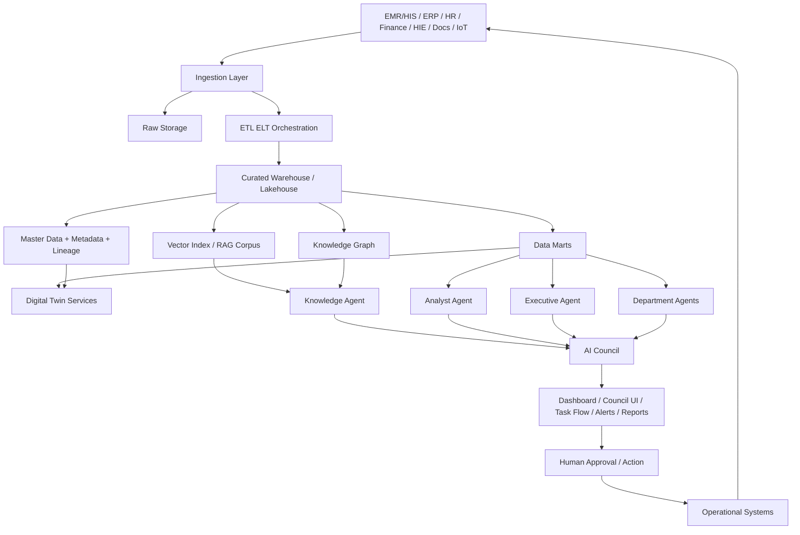
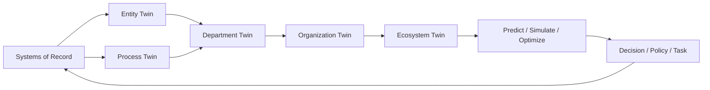
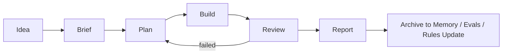

# รายงานออกแบบ AI Agent Office และ Digital Twin ระดับองค์กรสำหรับหน่วยงานสุขภาพ

## บทสรุปผู้บริหาร

รายงานนี้เสนอแบบอ้างอิงเชิงสถาปัตยกรรมสำหรับการสร้าง **AI Agent Office** ร่วมกับ **Digital Twin ระดับองค์กรและระบบนิเวศสุขภาพ** โดยออกแบบให้ใช้ได้ตั้งแต่ระดับโรงพยาบาลเดี่ยว สำนักงานสาธารณสุขจังหวัด ไปจนถึงเครือข่ายหลายโรงพยาบาล แนวคิดหลักคือเปลี่ยน AI จาก “ผู้ช่วยถาม-ตอบ” ให้เป็น “ทีมงานดิจิทัล” ที่มีบทบาท หน้าที่ สิทธิ์เข้าถึง ขอบเขตการตัดสินใจ การส่งต่องาน และระบบตรวจสอบอย่างเป็นทางการ เหมือนสำนักงานจริง และต้องทำงานบนข้อมูลจริงที่มีการเชื่อมกับ HIS/EMR, HIE, data marts, เอกสารนโยบาย, และระบบงานธุรการอย่างปลอดภัยภายใต้ PDPA และกรอบ AI governance ระดับองค์กร citeturn0search1turn1search1turn3search0turn6search2turn7search0turn7search1

ข้อเสนอสำคัญที่สุดคือ **ไม่ควรเริ่มจาก agent จำนวนมาก** แต่ควรเริ่มจาก “สำนักงานกลาง 10 agents” ที่ทำงานครอบคลุมผู้บริหารและงานส่วนกลางก่อน ได้แก่ Executive, Planner, Analyst, Knowledge, Action/Report, Data Governance, Finance, Operations, HR, และ Provincial/Ecosystem Agent จากนั้นจึงขยายเป็น 20 agents และ 50+ agents ตาม department pack และ use-case pack เพราะแนวทางแบบ simple composable agents มีต้นทุนต่ำกว่า ทดสอบง่ายกว่า และผูกกับผลลัพธ์ทางธุรกิจได้ดีกว่าระบบหลายเอเจนต์ที่ซับซ้อนตั้งแต่วันแรก citeturn0search1turn0search5turn16search11

ในมุม Digital Twin รายงานนี้เสนอว่า “digital twin ระดับองค์กร” ไม่ควรถูกตีความแค่ว่าเป็นภาพจำลองผู้ป่วยรายบุคคล แต่ควรครอบคลุม **entity twin, process twin, department twin, organization twin และ ecosystem twin** โดยต้องมี 4 คุณสมบัติขั้นต่ำตามนิยามที่เข้มงวดมากขึ้นของวงวิชาการ คือสะท้อนระบบจริง, อัปเดตแบบพลวัตจากระบบจริง, มีความสามารถเชิงพยากรณ์/จำลองสถานการณ์, และส่งผลต่อการตัดสินใจในโลกจริงผ่าน feedback loop หากขาดองค์ประกอบเหล่านี้ ระบบอาจยังเป็นเพียง “digital model” หรือ “digital shadow” มากกว่าจะเป็น “digital twin” เต็มรูปแบบ ซึ่งเป็นสิ่งที่เกิดขึ้นบ่อยในงานด้านสุขภาพปัจจุบัน citeturn3search0turn3search18turn2search2turn2search20

สำหรับประเทศไทย สถาปัตยกรรมอ้างอิงควรผูกกับทิศทางการเชื่อมโยงข้อมูลสุขภาพผ่าน **HL7 FHIR**, HIE/FHIR Gateway, และชุดข้อมูลมาตรฐานของกระทรวงสาธารณสุข โดยแยก “ระบบปฏิบัติการข้อมูล” ออกจาก “ชั้นการวิเคราะห์และเอเจนต์” ให้ชัด เพื่อให้ขยายจากโรงพยาบาลเดี่ยวไปสู่ระดับจังหวัดและเครือข่ายบริการได้ง่ายขึ้น และไม่ต้อง rewrite HIS ใหม่ทั้งระบบตั้งแต่ต้น กระทรวงสาธารณสุขไทยได้ประกาศขับเคลื่อน HL7 FHIR และมีทิศทาง MOPH Exchange Gateway/FHIR Gateway อย่างชัดเจนแล้ว จึงเหมาะอย่างยิ่งกับสถาปัตยกรรมแบบ agent + twin + data platform citeturn4search0turn4search1turn5search2turn5search8turn5search9

ข้อเสนอเชิงปฏิบัติสำหรับทีม product และ engineering คือให้เริ่มจาก **MVP 90 วัน** ที่เน้น 3 ผลลัพธ์: ผู้บริหารถามคำถามเชิงบริหารได้จริง, หน่วยงานมี work queue/brief-review-report flow ที่ตรวจสอบย้อนหลังได้, และเอกสาร/ตัวเลขที่เอเจนต์ใช้มี provenance ชัดเจนผ่าน RAG + metadata + lineage จากนั้นใน **180 วัน** ให้ขยายไปยัง department agents และ twin ระดับ flow/department และใน **365 วัน** จึงค่อยยกระดับเป็น AI Council, simulation, จังหวัด/เครือข่าย, และ cost-aware orchestration พร้อม observability/evaluation ครบวงจร citeturn14search16turn14search12turn7search2turn7search3turn11search0turn11search13

## เป้าหมาย ขอบเขต และกรอบแนวคิด

AI Agent Office ระดับองค์กรหมายถึงระบบที่รวมเอเจนต์หลายบทบาทเข้าไว้ภายใต้กติกางานเดียวกัน โดยแต่ละ agent มีคำบรรยายบทบาทชัดเจน รับงานจากคนหรือ agent อื่นในรูปแบบที่กำหนด มีสิทธิ์ใช้เครื่องมือและข้อมูลเท่าที่จำเป็น และส่งมอบผลลัพธ์ที่ตรวจสอบย้อนกลับได้ ต่างจาก chatbot ทั่วไปซึ่งมักไม่มี state, ไม่มี handoff contract, ไม่มี audit trail และไม่มี lifecycle management แบบระบบงานจริง หลักนี้สอดคล้องกับแนวทางของ Anthropic ที่แยก “workflow” ออกจาก “agent” และแนะนำให้สร้างระบบที่เรียบง่าย แยกบทบาท และวัดผลได้ก่อนจะขยายความอัตโนมัติ citeturn0search1turn1search1turn16search11

เป้าหมายเชิงธุรกิจและการใช้งานที่เหมาะสมสำหรับหน่วยงานสุขภาพมีอย่างน้อย 5 มิติที่ควรออกแบบไว้ตั้งแต่ต้น ได้แก่ **การสนับสนุนการตัดสินใจผู้บริหาร**, **การปฏิบัติการและ throughput**, **สาธารณสุขและ population health**, **การเงินและ claims/revenue cycle**, และ **ทรัพยากรบุคคล/กำลังคน** โดยแต่ละมิติต้องใช้ข้อมูลคนละชุด ระดับ latency คนละแบบ และระดับสิทธิ์คนละชั้น เช่น executive decision support ต้องใช้ data mart และ policy knowledge ที่สังเคราะห์แล้ว ส่วน operations ต้องพึ่ง event stream/queue/bed/appointment เกือบ real time ขณะที่ public health ต้องใช้ surveillance และ geographic layers และ finance ต้องเน้น reconciliation, aging, case mix, และ auditability มากเป็นพิเศษ citeturn2search16turn2search7turn3search20turn4search0turn5search8

ในเชิงขอบเขต ผมแนะนำให้แบ่ง deployment model ออกเป็น 3 ระดับตั้งแต่แรกเพื่อหลีกเลี่ยงการออกแบบที่ “ใช้ได้เฉพาะโรงพยาบาลเดียว” ระดับแรกคือ **single hospital** ซึ่งเหมาะกับ executive office, bed-flow twin, visit-flow twin, claim/finance agent, และ knowledge assistant ภายในองค์กร ระดับที่สองคือ **provincial health office** ซึ่งต้องเพิ่ม ecosystem view, referral view, workforce view และ outbreak/public-health view ระดับที่สามคือ **multi-hospital ecosystem** ซึ่งต้องมี federated data access, common metadata, และ governance ที่แยกการเป็น data owner ออกจาก query/analytics consumer อย่างชัดเจน รวมถึงรองรับมาตรฐานแลกเปลี่ยนข้อมูลและ policy controls ข้ามหน่วยงาน citeturn3search0turn4search0turn5search8turn11search13

Digital twin ที่เหมาะกับองค์กรสุขภาพควรนิยามเป็น “ชั้นของแบบจำลอง” มากกว่าจะเป็นโมเดลเดียว โดยในระดับใช้งานจริงควรประกอบด้วย 5 ชั้น คือ **entity twin** เช่น คนไข้ เตียง บุคลากร รถ refer เครื่องมือแพทย์, **process twin** เช่น OPD flow, OR schedule, discharge flow, claim flow, **department twin** เช่น OPD/IPD/ER/Finance/HR, **organization twin** เช่น hospital dashboard + simulation, และ **ecosystem twin** เช่น จังหวัด เขตสุขภาพ หรือเครือข่าย refer หากต้องการใช้คำว่า digital twin อย่างเข้มงวด ควรมีข้อมูลอัปเดตจากระบบจริงและมีความสามารถพยากรณ์หรือจำลองสถานการณ์ ไม่ใช่เพียง dashboard แบบ static หรือ monthly BI report citeturn3search0turn2search2turn2search1turn2search16

## สถาปัตยกรรมอ้างอิงของระบบ

สถาปัตยกรรมที่เหมาะที่สุดสำหรับ AI Agent Office ในองค์กรสุขภาพ คือ **แยก 6 ชั้น** ออกจากกันอย่างชัดเจน ได้แก่ systems of record, ingestion/integration, analytics/data marts, knowledge/RAG/graph, agent runtime and model infra, และ visualization/work management ชั้นล่างสุดควรเก็บระบบเดิมทั้งหมดไว้ เช่น EMR/HIS, LIS, RIS/PACS, ERP, HR, finance, claim, office documents, telemedicine, และ HIE/FHIR gateway จากนั้นจึง ingest เข้าสู่ data platform ที่มี ETL/ELT, master data, metadata, และ lineage ก่อนนำไปใช้ทั้งใน BI/twin และ agent runtime วิธีนี้ทำให้ agent ไม่กลายเป็น “ระบบอีกก้อนที่ไปดึงฐานข้อมูลตรงแบบไม่รู้ที่มา” และช่วยให้ควบคุมสิทธิ์ สืบย้อน และตรวจสอบคุณภาพข้อมูลได้จริง citeturn4search0turn4search1turn4search3turn5search8turn11search0turn11search3turn11search13



แบบจำลอง twin ควรถูกสร้างจากทั้งข้อมูลเชิงธุรกรรมและข้อมูลเชิงความรู้ ไม่ใช่จาก data mart เพียงอย่างเดียว เพราะในงานผู้บริหารหรือสาธารณสุข คำถามจำนวนมากมีคำตอบได้ก็ต่อเมื่อผสม **ตัวเลข + นิยามตัวชี้วัด + policy + SOP + network context** เช่น “ทำไม waiting time ดีขึ้นแต่ complaint สูงขึ้น” หรือ “ถ้าขยาย chronic fast-track จะกระทบ nurse FTE เท่าไร” ซึ่งลักษณะนี้เป็นโจทย์ที่ RAG และ knowledge graph มีบทบาทช่วยเชื่อม semantic context กับ structured metrics ได้ดี โดย RAG มีจุดแข็งเรื่องอัปเดตความรู้และการแสดง provenance ส่วน graph-based retrieval มีประโยชน์มากกับคำถามกว้าง คำถามเชื่อมหลายเอกสาร และการสรุป narrative/private corpora ที่ซับซ้อน citeturn9search0turn9search2turn8search1turn8search3turn8search13turn8search0



การเชื่อมต่อควรยึดมาตรฐาน interoperable เท่าที่เป็นไปได้ โดยในเลเยอร์เชิงคลินิกและแลกเปลี่ยนข้อมูลควรใช้ **HL7 FHIR** และ **SMART on FHIR** สำหรับ auth/discovery ของแอปหรือ service ที่ต้องเข้าถึงข้อมูลผ่านบริบทผู้ใช้ ส่วน imaging ควรใช้ **DICOM** และสำหรับ data mart เชิงวิเคราะห์ระดับข้ามหน่วยงานหรือวิจัย สามารถพิจารณา **OMOP CDM** เป็นชั้นมาตรฐานเสริมได้เมื่อเป้าหมายคือ cross-site analytics หรือ evidence generation มากกว่างานทรานแซกชันใน HIS โดยเฉพาะ ในบริบทไทย ควรวางสถาปัตยกรรมให้เชื่อมกับ HIE/FHIR Gateway ของ สธ. และชุดมาตรฐานข้อมูลระดับประเทศตั้งแต่ระยะ MVP เพื่อไม่ให้เกิด technical debt ในระยะขยายผล citeturn4search0turn4search1turn4search2turn4search3turn4search6turn5search2turn5search8turn5search9

ชั้นข้อมูลควรถูกออกแบบเป็น **ingest → raw → transform → curated → marts → semantic/retrieval** พร้อมระบบ master data, metadata catalog และ lineage ที่มองได้ทั้งระดับ dataset และ pipeline job การมี metadata และ lineage ไม่ใช่เรื่องหรู แต่เป็นเงื่อนไขสำคัญสำหรับ agent office เพราะถ้าเอเจนต์ตอบคำถามผู้บริหารได้แต่บอกไม่ได้ว่าตัวเลขมาจากไหน ใช้ definition ใด และผ่าน transformation อะไรมาบ้าง ระบบจะใช้ต่อในระดับกำกับงานจริงไม่ได้ เครื่องมืออย่าง OpenLineage, DataHub, dbt docs และ Airflow ถูกออกแบบมาเพื่อรองรับภาพนี้โดยตรง citeturn11search0turn11search4turn11search13turn11search6turn11search3

## อนุกรมวิธานของเอเจนต์และเวิร์กโฟลว์งาน

หลักการออกแบบ taxonomy ของ agent ควรตอบ 6 คำถามทุกตัวเสมอ คือ **บทบาท**, **อินพุต**, **เอาต์พุต**, **สิทธิ์และเครื่องมือที่ใช้ได้**, **โหมดล้มเหลวที่พบบ่อย**, และ **กติกาการส่งต่องาน** การออกแบบแบบนี้สอดคล้องกับแนวคิด subagents และ permissions ของ Claude Code/Agent SDK ซึ่งเปิดให้กำหนด system prompt, tool access, sessions, hooks และรูปแบบ delegation แยกกันตาม agent ได้ รวมถึงใช้ CLAUDE.md เป็น persistent project memory และใช้ hooks เพื่อบังคับ checkpoint, block command, inject context หรือทำ automated review ก่อน action ที่มีความเสี่ยงได้ citeturn1search5turn16search0turn16search1turn16search2turn16search11

ตารางต่อไปนี้เป็น taxonomy ขั้นต่ำสำหรับ **agent กลุ่มหลัก 6 ประเภท** ที่เหมาะกับองค์กรสุขภาพระดับโรงพยาบาลและระดับจังหวัด โดยตั้งใจให้เริ่มจากโครงสร้างง่ายก่อน แล้วค่อยแตกออกเป็น subagents/department agents เมื่อมีข้อมูล กระบวนงาน และ governance พร้อม ทั้งหมดนี้ยึดตามหลัก “simple composable patterns” และ “clear role separation” เป็นแกนกลาง citeturn0search1turn0search5turn16search0turn16search11

| ประเภท Agent | Role | Inputs | Outputs | DOs / DON'Ts | Success Metrics | Estimated Compute / Cost Profile |
|---|---|---|---|---|---|---|
| Executive Agent | สรุปภาพรวมองค์กรและเสนอทางเลือกตัดสินใจ | KPI marts, alerts, policy context, council memos | executive brief, scenario memo, decision options, risk note | **DO:** สรุป trade-off, ระบุแหล่งข้อมูล, escalate เมื่อความมั่นใจต่ำ **DON'T:** สั่งปฏิบัติการเองโดยไม่มี approval | brief accuracy, decision lead time, citation coverage, acceptance by executives | กลางถึงสูง |
| Planner Agent | แปลง idea/mandate เป็น brief-plan-task | user request, strategic goals, constraints, templates | structured brief, work plan, owners, deadlines, handoff packages | **DO:** แตกงานเป็นขั้น, ระบุ dependencies **DON'T:** ข้าม review gate หรือ commit scope เอง | plan completeness, rework rate, on-time handoff | ต่ำถึงกลาง |
| Analyst Agent | วิเคราะห์ข้อมูลและสร้าง insight เชิงเหตุผล | data marts, SQL results, benchmarks, trend windows | analysis note, charts, anomaly flags, forecast, drilldown list | **DO:** ระบุ definition และ caveat **DON'T:** fabricate metric definitions | metric correctness, anomaly precision, analyst adoption | กลาง |
| Knowledge Agent | ค้นคืนความรู้และ semantic grounding | SOP, guideline, circulars, meeting notes, contracts | cited answer, evidence pack, policy summary, precedent map | **DO:** คืน provenance และ snippet context **DON'T:** ตีความนโยบายเกินหลักฐาน | grounded answer rate, retrieval precision, citation quality | ต่ำถึงกลาง |
| Action Agent | สร้าง artefacts และทำงาน downstream ที่อนุญาต | approved brief, templates, structured data, report spec | draft report, memo, PPT, email, dashboard config, tickets | **DO:** ใช้ template มาตรฐาน **DON'T:** ส่งจริงหรือแก้ระบบจริงถ้าไม่มี approval token | turnaround time, template conformance, few-shot compliance | ต่ำ |
| Department Agents | ลงลึกภารกิจเฉพาะ เช่น OPD, IPD, ER, TB, Dengue, Finance, HR | department feeds, queue events, local SOP, service targets | departmental alerts, action list, local forecasts, exception escalations | **DO:** ทำงานเฉพาะ domain ตนเอง **DON'T:** ตัดสินใจข้ามหน่วยงานเองโดยไม่ผ่าน planner/council | department KPI improvement, signal-to-noise, escalation quality | กลางถึงสูง |

หมายเหตุ: cost profile ในตารางเป็น **ประมาณการเชิงสถาปัตยกรรม** โดยประเมินจากความลึกของ reasoning, ปริมาณ retrieval/tool calls, fan-out ไปยัง subagents, และ burden ของ review loop ไม่ใช่ราคาใบเสนอขายจากผู้ผลิตรายใด โดยแนวทางของ Anthropic ชี้ชัดว่าระบบที่เรียบง่ายและแยกหน้าที่ชัดเจนจะมีต้นทุนต่ำกว่าและ debug ได้ง่ายกว่า ในขณะที่ระบบที่ให้ agent ทำทุกอย่างมักมี cost และ failure surface สูงกว่า citeturn0search1turn0search5turn14search3

ตัวอย่าง **job description template แบบสั้น** สำหรับเอเจนต์ควรใช้รูปแบบเดียวกันทั้งองค์กรเพื่อให้ governance ง่ายขึ้น ดังตัวอย่างต่อไปนี้

```text
Name: Finance Claim Agent
Mission: ตรวจจับความเสี่ยง claim ตกหล่นและเสนอ action ที่ประหยัดเวลาหน้างาน
Primary Inputs: claim queue, billing logs, denial reasons, payer rules
Primary Outputs: daily claim exception list, root-cause summary, recommended fixes
Allowed Tools: SQL read-only, claims API read-only, document retrieval
Forbidden Actions: submit claim, alter financial records, override rules
Escalation Rule: ถ้าความเชื่อมั่น < 0.8 หรือเจอความเสี่ยงทางกฎหมาย ให้ส่งต่อ CFO Agent + Human Reviewer
Success Metrics: denial rate down, turnaround time down, audit pass rate
```

```text
Name: Provincial Dengue Agent
Mission: เฝ้าระวังสัญญาณเสี่ยงระดับอำเภอและเสนอ intervention package ที่อธิบายได้
Primary Inputs: surveillance data, weather/environmental signals, bed capacity, local SOP
Primary Outputs: hotspot map, risk forecast, district action list, weekly memo
Allowed Tools: epidemiology marts, GIS layer read-only, guideline retrieval
Forbidden Actions: publish alert to public without human approval
Escalation Rule: ถ้าเกิน threshold หรือเกิด cluster หลายอำเภอ ให้ส่งต่อ PHEOC Agent
Success Metrics: detection lead time, false alert rate, intervention timeliness
```

โครงสร้างไฟล์โปรเจกต์ที่แนะนำ เพื่อให้ Claude Code/Agent SDK และทีมวิศวกรรมทำงานร่วมกันได้ต่อเนื่อง ควรมีโครงสร้างถาวรลักษณะนี้ โดยใช้ไฟล์บริบทถาวรแทนการใส่ prompt ยาวซ้ำทุกครั้ง ซึ่งสอดคล้องกับแนวทาง CLAUDE.md, sessions, hooks และ subagents ของ Anthropic อย่างมาก citeturn1search5turn16search0turn16search1turn16search11

```text
hosprime-agent-office/
├── README.md
├── AGENTS.md
├── SOP.md
├── TASKS.md
├── GOVERNANCE.md
├── SECURITY.md
├── schemas/
│   ├── task_handoff.schema.json
│   ├── report.schema.json
│   └── alert.schema.json
├── prompts/
│   ├── executive.md
│   ├── planner.md
│   ├── analyst.md
│   └── department/
├── data_contracts/
│   ├── kpi_dictionary.yaml
│   ├── source_registry.yaml
│   └── access_policies.yaml
├── dags/
├── dbt/
├── agents/
├── evals/
└── dashboards/
```

ตัวอย่างเนื้อหาสั้นในไฟล์สำคัญ

```md
# AGENTS.md
- Executive Agent: ตอบเฉพาะคำถามเชิงบริหาร ใช้ data marts + council memos เท่านั้น
- Planner Agent: แปลง requirement เป็น structured brief ก่อนเสมอ
- Analyst Agent: ห้ามคำนวณ KPI หากไม่พบ definition ใน kpi_dictionary.yaml
- Knowledge Agent: ทุกคำตอบต้องมี citations และ source confidence
- Action Agent: ห้ามส่งอีเมล/แก้ข้อมูลจริง ถ้าไม่มี approval_token
```

```md
# SOP.md
## Review Gate
1. Planner creates brief
2. Analyst validates numbers
3. Knowledge Agent attaches evidence
4. Reviewer signs off
5. Action Agent generates deliverable
```

```md
# TASKS.md
- [ ] Build waiting-time twin for OPD
- [ ] Connect FHIR Encounter feed
- [ ] Define dashboard drilldowns
- [ ] Add alert thresholds for ER boarding
```

เวิร์กโฟลว์หลักที่ควรใช้เป็น default workflow คือ **Idea → Brief → Plan → Build → Review → Report** เพราะบังคับให้ระบบคิดเป็นขั้น ลดการกระโดดจาก “คำสั่ง” ไปเป็น “การลงมือกระทำ” โดยไม่มีการตีความ requirement หรือ review gate ซึ่งเป็นความเสี่ยงสำคัญของระบบ agentic ในองค์กรที่ต้องกำกับคุณภาพและความรับผิดได้จริง citeturn0search1turn14search16turn14search12



เวิร์กโฟลว์แบบแปรผันที่ควรมีเพิ่มสำหรับองค์กรสุขภาพ คือ **Alert → Triage → Investigate → Decide → Act → Audit** สำหรับงานเฝ้าระวังหรือ anomaly detection และ **Meeting → Extract Action Items → Assign → Track → Escalate → Close** สำหรับงานสำนักงาน/โครงการ เนื่องจากรูปแบบงานจริงไม่ได้มีแต่ build flow แบบทีมซอฟต์แวร์ การใส่ workflow variants ตั้งแต่แรกช่วยให้แต่ละ agent มีพฤติกรรมสม่ำเสมอและลด prompt sprawl ได้มาก citeturn16search2turn7search2turn14search1

ตัวอย่าง **message schema สำหรับ handoff** ที่ควรใช้เป็นสัญญาเชิงเทคนิคระหว่าง agent

```json
{
  "task_id": "TASK-2026-06-OPD-0012",
  "from_agent": "PlannerAgent",
  "to_agent": "AnalystAgent",
  "task_type": "analysis",
  "priority": "high",
  "objective": "Assess OPD waiting time root causes in last 30 days",
  "scope": {
    "organization_id": "CRH001",
    "department": "OPD",
    "time_window": "P30D"
  },
  "inputs": {
    "kpi_definitions_ref": "data_contracts/kpi_dictionary.yaml#waiting_time",
    "data_sources": ["encounter_mart", "queue_event_mart", "provider_schedule_mart"],
    "policy_refs": ["SOP.md#opd-flow"]
  },
  "constraints": {
    "must_cite_sources": true,
    "max_runtime_minutes": 10,
    "read_only": true
  },
  "expected_output": {
    "format": "analysis_memo",
    "sections": ["summary", "findings", "drilldowns", "risks", "recommendations"],
    "confidence_required": 0.8
  },
  "escalation": {
    "on_failure_to": "HumanReviewer",
    "on_low_confidence_to": "KnowledgeAgent"
  }
}
```

```json
{
  "task_id": "TASK-2026-06-EXEC-0004",
  "from_agent": "ExecutiveAgent",
  "to_agent": "ActionAgent",
  "task_type": "report_generation",
  "approval_token": "APR-EXEC-88421",
  "objective": "Generate weekly executive briefing deck",
  "inputs": {
    "council_memo_ref": "memo://council/2026-W24",
    "charts_ref": ["chart://waittime_w24", "chart://bed_occupancy_w24"],
    "style_template": "templates/executive_weekly_v3.pptx"
  },
  "guardrails": {
    "external_send": false,
    "watermark_draft": true,
    "include_provenance_appendix": true
  }
}
```

## ธรรมาภิบาล การกำกับดูแล และการคุ้มครองข้อมูล

AI Agent Office ใช้งานในระดับองค์กรไม่ได้หากไม่มี governance ที่จริงจังพอสมควร เพราะ agent ไม่ใช่แค่ feature UI แต่เป็น “ผู้กระทำการเชิงซอฟต์แวร์” ที่ใช้ข้อมูล ใช้เครื่องมือ และอาจส่งผลต่อคน ระบบ และทรัพยากร ดังนั้นควรออกแบบ governance ให้ครอบคลุม **lifecycle, versioning, permissions, cost control, observability, audit, และ council review** ตั้งแต่วันแรก โดยใช้ทั้งกรอบสากลอย่าง NIST AI RMF/Generative AI Profile และกรอบไทยอย่าง ETDA AI Governance Guideline for Organizations เป็นโครงสร้างแม่ในการแบ่งความรับผิดและการควบคุมความเสี่ยง citeturn0search3turn6search2turn6search5turn6search6

สำหรับโครงสร้างกำกับระดับบน ผมแนะนำให้มี **AI Council** เป็นชุด governance และ decision forum ไม่ใช่เป็นเพียง UI สวย ๆ โดยองค์ประกอบขั้นต่ำควรมี Executive Sponsor, Product Owner, Clinical/Public Health Owner, Data Governance Lead, Security/PDPA Lead, และ Engineering Lead บทบาทของ Council คืออนุมัติ use-case, risk tier, human-in-the-loop requirement, release gates, และ rollback policy โดยเฉพาะ use-cases ที่แตะข้อมูลสุขภาพ sensitive, การเงิน, การจัดกำลังคน, หรือการแจ้งเตือนที่อาจกระทบการบริการผู้ป่วยหรือประชาชนโดยตรง citeturn0search3turn6search2turn6search5turn7search0

ภายใต้กฎหมายไทย ข้อมูลสุขภาพเป็น **ข้อมูลส่วนบุคคลที่มีความอ่อนไหว** และ PDPA มาตรา 26 กำหนดข้อจำกัดในการประมวลผล โดยมีข้อยกเว้นบางกรณีเพื่อประโยชน์สาธารณะด้านสาธารณสุข การควบคุมโรคติดต่อ หรือมาตรฐานคุณภาพ อย่างไรก็ตาม การมีข้อยกเว้นตามกฎหมายไม่ได้แปลว่า agent จะเข้าถึงข้อมูลได้อย่างเสรี ยังต้องปฏิบัติตามหลักจำกัดวัตถุประสงค์ ความจำเป็นตามหน้าที่ การกำหนดสิทธิ์ตามบทบาท การบันทึกการประมวลผล การรักษาความมั่นคงปลอดภัย และสิทธิของเจ้าของข้อมูลอย่างครบถ้วน citeturn5search1turn5search3turn0search10turn13search0

เช็กลิสต์ governance และ security/PDPA controls ขั้นต่ำที่ควรมีในระบบมีดังนี้

- มี **agent registry** ระบุ owner, purpose, risk tier, model version, allowed tools, allowed data domains และ approval level ของแต่ละ agent อย่างชัดเจน citeturn6search2turn7search1
- ใช้ **RBAC/ABAC** แยก read-only, write-with-approval, publish-with-approval, และ no-external-share เป็นนโยบายพื้นฐานสำหรับทุก agent และทุก tool endpoint citeturn16search11turn16search1
- บังคับ **provenance/citation** สำหรับทุกคำตอบที่ใช้ RAG หรือข้อมูล policy และบังคับ confidence threshold สำหรับงานตัดสินใจสำคัญ citeturn9search0turn14search16
- ป้องกัน **prompt injection, insecure output handling, sensitive information disclosure, excessive agency และ supply-chain vulnerabilities** ตามชุดความเสี่ยง OWASP for LLM Applications citeturn7search0turn7search4
- บันทึก **trace, metrics, logs** ของทุก request, tool call, handoff และ approval ด้วย observability framework กลาง เช่น OpenTelemetry และผูกกับ agent/session ID citeturn7search2turn7search6
- เก็บ **evaluation data, prompt version, code version, model version และ artifacts** เพื่อสืบย้อนและทำ regression testing ผ่านระบบอย่าง MLflow หรือเครื่องมือเทียบเท่า citeturn7search3turn14search1turn14search5
- มี **data lineage และ metadata catalog** สำหรับ KPI, marts, และ policy corpora เพื่อให้ agent อ้างอิงได้ว่า “ใช้คำจำกัดความใด” และ “ตัวเลขมาจาก pipeline ใด” citeturn11search0turn11search13turn11search6
- บังคับ **human approval token** ก่อน action ที่ส่งผลภายนอก เช่น ส่งหนังสือราชการ, publish alert, เปลี่ยนข้อมูลการเงิน, create appointment รอบใหม่, หรือ push policy to production citeturn16search1turn16search2
- มี **release tiers** แยก sandbox, limited pilot, production assistive, และ production automating เพื่อไม่ให้ agent ข้าม maturity level เร็วเกินไป citeturn0search1turn0search3

การทำ versioning ควรเป็น **three-part versioning** คือ `agent_prompt_version`, `tool_contract_version`, และ `knowledge_snapshot_version` เพราะ agent ล้มเหลวได้จากหลายชั้น ไม่ใช่เฉพาะรุ่นโมเดล เช่น prompt ดีแต่ knowledge corpus เปลี่ยน หรือ prompt เดิมแต่ API contract เปลี่ยน การจัด versioning แบบแยกชั้นทำให้ rollback และ A/B testing ง่ายขึ้นกว่าการติดป้ายว่าเป็น “Agent v2” แบบกว้าง ๆ เพียงอย่างเดียว แนวคิดนี้สอดคล้องกับวิธีคิดเรื่อง test, evaluation, registry, และ secure SDLC ในเอกสารของ Anthropic, NIST SSDF และ MLflow อย่างมาก citeturn14search16turn14search12turn7search1turn7search7

## UX การแสดงผล การติดตั้งใช้งาน และเครื่องมือแนะนำ

UI ของ AI Agent Office ควรเน้น **การอ่านแล้วตัดสินใจได้** มากกว่า “ดูฉลาด” ดังนั้นเลย์เอาต์ที่ดีควรมี 5 พื้นที่เสมอ คือ executive overview, alerts/exceptions, council recommendations, task flow/status, และ drilldown/evidence panel โดยผู้ใช้แต่ละระดับจะเห็นไม่เหมือนกัน เช่น ผู้อำนวยการเห็น KPI และ scenario options มากกว่า query detail ส่วนหัวหน้ากลุ่มงานเห็นคิวงาน ข้อยกเว้น และ root causes มากกว่า brief เชิงกลยุทธ์ การทำ UI แบบนี้ทำให้ agent office กลายเป็น workspace ของการกำกับงาน ไม่ใช่แค่กล่องสนทนาเดียว citeturn0search1turn7search2turn14search10

ตัวอย่าง wireframe ที่ใช้งานได้จริงสำหรับ dashboard หน้าแรก

```text
┌──────────────────────────────────────────────────────────────────────────────┐
│ HOSPRIME AGENT OFFICE                                                       │
│ Date: 2026-06-16   Org: Chiang Rai Provincial Health Office                 │
├───────────────────────┬───────────────────────────────┬─────────────────────┤
│ Executive Snapshot    │ AI Council Recommendations    │ Active Alerts       │
│ - KPI on/off target   │ - Reduce ER boarding          │ - TB LTFU ↑         │
│ - Financial status    │ - Reallocate OPD slots        │ - Dengue hotspot    │
│ - Workforce pressure  │ - Add ward discharge rounds   │ - Claim denial ↑    │
├───────────────────────┴───────────────────────────────┴─────────────────────┤
│ Task Flow                                                                   │
│ Idea → Brief → Plan → Build → Review → Report                              │
│ [3] waiting approval   [8] in analysis   [5] ready to report               │
├──────────────────────────────────────────────────────────────────────────────┤
│ Drilldown / Evidence                                                        │
│ - KPI definition                                                            │
│ - Source systems / lineage                                                  │
│ - Retrieved SOP / policy / circular                                         │
│ - Top contributing districts / clinics / wards                              │
├──────────────────────────────────────────────────────────────────────────────┤
│ Chat / Command Bar                                                          │
│ "สรุปสาเหตุ waiting time OPD 30 วันล่าสุด พร้อมข้อเสนอ 3 ทางเลือก"         │
└──────────────────────────────────────────────────────────────────────────────┘
```

จุดเชื่อมต่อกับระบบเดิมควรถูกแยกเป็น **integration catalog** เช่น EMR/HIS, LIS, RIS/PACS, ERP/Finance, HR, HIE/FHIR, office docs, email/calendar, public health surveillance, geospatial, และ external APIs โดยแต่ละ integration ต้องมี owner, auth method, data contract, sync mode, latency expectation, และ allowed agent classes ที่เข้าถึงได้ วิธีนี้ช่วยให้ทีม engineering, security และ product คุยกันด้วยภาษากลางเดียวกัน และสอดคล้องกับแนวคิด metadata-driven operations และ discoverable data platform citeturn11search13turn11search0turn4search0turn5search8

ในเชิง deployment ผมแนะนำให้แบ่งเป็น 3 ระยะทางเทคนิค

ตระกูลแรกคือ **MVP stack แบบ pragmatic**: Claude Code/Agent SDK สำหรับ developer experience และ agent prototyping, Airflow หรือ orchestration เทียบเท่าสำหรับ data/jobs, warehouse/lakehouse + dbt สำหรับ curated marts, pgvector หรือ Qdrant สำหรับ retrieval, DataHub/OpenLineage สำหรับ metadata/lineage, OpenTelemetry + MLflow สำหรับ tracing/evaluation, และ web dashboard/application layer สำหรับ council/task UI วิธีนี้เหมาะกับทีมเล็กและช่วยให้ปล่อยของได้เร็วโดยยังมีเสาหลักด้าน governance ครบพอสมควร citeturn1search1turn16search11turn11search3turn11search6turn8search6turn10search2turn11search13turn7search2turn14search1

ตระกูลที่สองคือ **scaled enterprise stack**: ใช้ orchestration/stateful agent framework อย่าง LangGraph เมื่อต้องมี long-running workflows, human-in-the-loop และ state graph ที่ซับซ้อนมากขึ้น; ใช้ LlamaIndex เมื่อ emphasis อยู่ที่ document-heavy RAG, parsing, reranking และ agent workflows; ใช้ KServe/vLLM/NVIDIA NIM เมื่อต้อง self-host หรือ hybrid-host โมเดลในสภาพแวดล้อมที่ต้องควบคุมข้อมูลและต้นทุนเชิง inferencing อย่างจริงจัง citeturn10search0turn10search11turn10search1turn10search19turn15search0turn15search1turn15search3

ตารางแนะนำเครื่องมือและเหตุผลเชิงสถาปัตยกรรมมีดังนี้

| หมวด | เครื่องมือแนะนำ | เหตุผลหลัก | ใช้เมื่อ | ข้อควรระวัง |
|---|---|---|---|---|
| Agent shell / coding | Claude Code | เข้าใจ codebase, แก้ไฟล์, รันคำสั่ง, รองรับ persistent memory ผ่าน CLAUDE.md | ทีมกำลัง build agent office และต้อง iterate เร็ว | ต้องกำหนด permissions/hook/rules ให้ชัด |
| Agent runtime SDK | Claude Agent SDK | ได้ tools, sessions, hooks, subagents, permissions แบบเดียวกับ Claude Code | ต้องการ production agent ที่โปรแกรมได้ | ต้องมี guardrails และ observability ครบ |
| Orchestration | LangGraph | เหมาะกับ long-running, stateful workflows และ human-in-the-loop | flow ซับซ้อนหลายขั้น/หลาย agent | เสี่ยง over-engineer หากใช้ตั้งแต่ MVP |
| RAG / Doc workflows | LlamaIndex | เด่นด้าน ingestion, indexing, workflows, RAG pipelines | เอกสารเยอะ, policy-heavy, need reranking | ต้องคุม parsing quality และ source hygiene |
| Vector storage | pgvector / Qdrant | pgvector ง่ายและอยู่ใน Postgres; Qdrant เด่นด้าน retrieval scale/filtering | pgvector สำหรับ MVP, Qdrant เมื่อ volume/filtering โต | อย่าตั้ง vector DB เป็น source of truth |
| Metadata / lineage | DataHub + OpenLineage | data catalog, governance, lineage | องค์กรมีหลาย datasets/pipelines/owners | ต้องมี stewardship จริงไม่ใช่ติดตั้งแล้วจบ |
| Observability | OpenTelemetry | trace/metrics/logs แบบ vendor-neutral | ต้อง debug agent and tool chains | ต้องออกแบบ span/tag naming ให้ดี |
| Eval / tracing | MLflow | tracing, evaluation, prompt/model/version tracking | ต้องทำ A/B, regression, review loop | ต้องเก็บ datasets/Test sets ต่อเนื่อง |
| Self-host model serving | vLLM / KServe / NIM | vLLM เร็วคุ้ม, KServe scale บน K8s, NIM enterprise runtime | ข้อมูลอ่อนไหวสูงหรือ hybrid deploy | complexity ด้าน infra สูงขึ้น |

การเลือกเครื่องมือควรยึดหลัก **ใช้ของง่ายพอสำหรับระยะปัจจุบัน แต่ไม่ปิดทางขยาย** และไม่ควรผูกติดกับค่ายเดียวเกินจำเป็น ตัวอย่างเช่น สำหรับโรงพยาบาลเดี่ยวที่เริ่มจาก 10 agents นั้น pgvector + Postgres อาจเพียงพอมากกว่า vector database ใหญ่เฉพาะทาง ขณะที่ระดับจังหวัดหรือ multi-hospital ecosystem ซึ่งมี corpus มากและต้อง filter ตามหน่วยงาน/สิทธิ์ซับซ้อน อาจได้ประโยชน์จาก Qdrant หรือ Milvus มากกว่า ส่วนโมเดล inference หากข้อกำหนด PDPA/sovereignty สูงจนต้อง self-host เต็มรูปแบบ ให้พิจารณา vLLM หรือ KServe/NIM แต่ถ้าเป้าหมายคือ speed-to-value และ use-case ยังเป็น assistive workflows การใช้ managed API บน governance ที่รัดกุมมักทำให้เริ่มได้เร็วกว่า citeturn8search6turn10search2turn10search3turn15search0turn15search1turn15search3turn1search12

ในด้าน cost control ควรใช้ **prompt caching**, retrieval minimization, knowledge snapshot reuse, และ hierarchical summarization ตั้งแต่แรก เพราะงาน agent office มีลักษณะ re-use context สูงมาก เช่น policy pack, KPI dictionary, organizational brief, และ fixed tool definitions ซึ่งเป็นเคสที่ prompt caching ช่วยลดทั้ง latency และค่าใช้จ่ายได้ชัดเจน citeturn14search3turn14search15

## การประเมินผล การเรียนรู้ และแผนขยายผล

ระบบ agent office ที่ดีต้องมี **review loop** เป็นส่วนหนึ่งของสถาปัตยกรรม ไม่ใช่เพิ่มภายหลัง โดยหลังจบงานทุกครั้งควรเก็บอย่างน้อย 5 อย่างคือ objective, output quality, time/cost, failure reason ถ้ามี, และ rules update candidate ถ้าพบว่าปัญหาเดิมเกิดซ้ำ จากนั้น feed กลับสู่ eval datasets, prompt/rule updates, knowledge corpus cleanup และ dashboard ปรับ threshold วิธีนี้ทำให้ระบบ “เรียนรู้เชิงระบบ” ได้โดยไม่จำเป็นต้อง retrain โมเดลหลักทุกครั้ง และสอดคล้องกับแนวทางการทำ evals ของ Anthropic และ MLflow อย่างมาก citeturn14search12turn14search16turn14search1turn14search13

metrics ที่ควรติดตั้งตั้งแต่ MVP แบ่งเป็น 4 กลุ่ม ได้แก่ **quality metrics** เช่น grounded answer rate, citation coverage, task success rate, reviewer accept rate; **operations metrics** เช่น latency, tool-call counts, cost/request, queue age; **business metrics** เช่น executive turnaround time, report cycle time, waiting-time variance, claim denial reduction; และ **risk metrics** เช่น policy violation count, low-confidence escalation rate, sensitive-data access incidents และ rollback count การวัดแบบนี้ทำให้มองเห็นทั้ง “ฉลาดไหม” และ “คุ้มไหม” พร้อมกัน ซึ่งสำคัญกว่าการวัดเพียง model score อย่างเดียว citeturn14search1turn14search6turn7search2turn7search3

A/B testing สำหรับ agent ควรทำเป็น **workflow-level experiments** มากกว่า model-only experiments เช่นเปรียบเทียบ Planner prompt v1 vs v2, compare retrieval strategy แบบ vector only vs hybrid/graph-augmented, หรือ compare Council review with and without Knowledge Agent attachment และควรเก็บผลทั้งด้านคุณภาพและต้นทุนเสมอ เพราะสถาปัตยกรรม agent มักมี trade-off ระหว่าง accuracy, latency, และค่าใช้จ่ายที่ชัดเจนมากกว่าระบบ Q&A ทั่วไป citeturn8search1turn8search3turn14search16turn14search18

แผน rollout ที่แนะนำสำหรับ 90/180/365 วันมีดังนี้

| ช่วงเวลา | เป้าหมาย | Agents เป้าหมาย | Milestones | ทีมหลัก | งบประมาณรวมโดยประมาณ |
|---|---|---:|---|---|---:|
| 90 วัน | MVP สำหรับผู้บริหารและสำนักงานกลาง | 10 | connect 3–5 data sources, knowledge corpus, executive dashboard, planner/analyst workflow, report generation, tracing/evals พื้นฐาน | Product owner, tech lead, 2 full-stack/data engineers, 1 analytics engineer, 1 domain lead, 1 security/data governance part-time | 300,000–1,200,000 |
| 180 วัน | ขยายสู่ operations + finance + HR + public health pilot | 20 | OPD/IPD/ER or public health pack, council UI, metadata/lineage, alert workflows, approval tokens, department dashboards | เพิ่ม backend/platform engineer, QA/evals, UI/UX, data steward | 1,200,000–4,500,000 |
| 365 วัน | จังหวัด/เครือข่าย หลายหน่วยงาน และ twin simulation ระดับ ecosystem | 50+ | ecosystem twin, referral/workforce/public-health layers, model serving strategy, federated governance, A/B framework, CI/CD for agents, production SRE | platform lead, MLOps/LLMOps, additional data engineers, integration team, PMO | 4,000,000–18,000,000 |

หมายเหตุเรื่องงบประมาณ: ตัวเลขข้างต้นเป็น **planning range** เพื่อใช้คุย scope และ staffing ตามที่ผู้ใช้ขอแบบไม่ระบุสกุลเงิน ไม่ใช่ใบเสนอราคาหรือ benchmark ตลาด และอาจเพิ่มขึ้นมากหากรวมงานเชื่อม HIS ซับซ้อน, data cleanup ครั้งใหญ่, security accreditation, หรือ self-host GPU stack เต็มรูปแบบ

แผน resource และความเสี่ยงควรมองเป็น 3 ชั้นพร้อมกัน คือ **product risk, data risk, governance risk** โดยความเสี่ยงที่พบบ่อยที่สุดไม่ใช่ “โมเดลไม่เก่งพอ” แต่คือ KPI definitions ไม่ตรงกัน, data contract ไม่เสถียร, เอกสารนโยบายไม่เป็นปัจจุบัน, ไม่มี owner ของ source systems, และ workflow ไม่ระบุจุดอนุมัติ ดังนั้น milestone สำคัญในช่วง 90 วันแรกควรเป็น “ตกลงนิยามข้อมูลและสิทธิ์” พอ ๆ กับการสร้าง UI หรือ agent เอง citeturn11search13turn11search0turn14search16turn0search3

สรุปเชิงปฏิบัติการสำหรับทีม product และ engineering คือให้เริ่มจาก **Executive Office + Data Platform + Knowledge Layer + Review Loop** ก่อน แล้วค่อยแตก department packs และ ecosystem twin ในภายหลัง โครงสร้างนี้จะทำให้ AI Agent Office เป็น “operating layer” ที่วางบนของเดิมได้จริง ไม่บังคับให้รื้อ HIS ทั้งหมด และยังสอดคล้องทั้งกับมาตรฐานด้าน interoperability, กรอบ AI governance, และทิศทาง digital health ของไทยมากที่สุดในปัจจุบัน citeturn5search2turn5search8turn6search5turn4search0turn0search1turn3search0